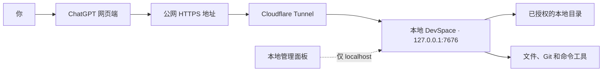

<p align="center">
  <strong>简体中文</strong> · <a href="./README_EN.md">English</a>
</p>

<p align="center">
  
</p>

<h1 align="center">DevSpace</h1>

<p align="center">
  <strong>让 ChatGPT 直接读取、修改和测试你电脑上的项目。</strong>
</p>

<p align="center">
  DevSpace 把你授权的本地目录转换成安全、可检查的 MCP 工具。<br>
  ChatGPT 操作的是真实本地文件，不需要把整个仓库上传到云端沙箱。
</p>

<p align="center">
  <a href="https://github.com/keepkeen/devspace/blob/main/LICENSE"></a>
  
  
  
</p>

<p align="center">
  <a href="#快速开始">快速开始</a> ·
  <a href="#连接-chatgpt">连接 ChatGPT</a> ·
  <a href="#怎么使用">怎么使用</a> ·
  <a href="#这个分支改进了什么">分支亮点</a> ·
  <a href="#安全边界">安全边界</a>
</p>

<p align="center">
  <a href="./docs/assets/devspace-screenshot.png">
    
  </a>
</p>

> [!IMPORTANT]
> 这是 [Waishnav/devspace](https://github.com/Waishnav/devspace) 的社区增强分支，
> 基于上游提交
> [`80423b5`](https://github.com/Waishnav/devspace/commit/80423b5)。
> 本仓库不是上游官方版本。

## DevSpace 是什么？

ChatGPT 运行在云端，正常情况下无法打开你电脑上的
`/Users/alice/code/my-app`。Code Interpreter 和网页版 Python 也运行在另一台
机器上，所以把本地路径发给它们是没有用的。

DevSpace 在你的电脑上启动一个轻量 MCP 服务。授权目录之后，ChatGPT 可以：

- 读取文件和搜索代码；
- 修改文件和应用补丁；
- 运行测试、Lint、构建和其他命令；
- 查看 Git 变更；
- 遵守 `AGENTS.md`、`CLAUDE.md` 和本地 Skill；
- 在对话结束或网络重新连接后继续使用同一个 workspace。

在普通工作流中，DevSpace 只是工具服务，不是另一个隐藏的编码模型。由
ChatGPT 自己决定调用哪些工具，每次调用都会显示在对话中。项目也提供可选的
本地子代理功能，但默认关闭。

专用文件工具只能打开允许列表中的目录。DevSpace 不会提前上传整个仓库；只有
工具调用实际返回的内容会发送给 MCP 客户端。

## 工作原理



公网地址用于传输 MCP 和 OAuth 请求。管理面板只监听本机地址，不会暴露到
Tunnel 上。

## 快速开始

### 环境要求

- Node.js `>=22.19 <27`
- npm 和 Git
- macOS/Linux 上的 Bash，或者 Windows 上的 Git Bash/WSL
- 一个公网 HTTPS Tunnel，例如
  [Cloudflare Tunnel](https://developers.cloudflare.com/cloudflare-one/connections/connect-networks/)
- 允许开启开发者模式的 ChatGPT 账号或工作区

安装依赖、构建项目和启动服务时应使用同一套 Node.js。DevSpace 使用原生模块
`better-sqlite3`，不同 Node ABI 之间不能直接混用。

### 1. 安装这个分支

```bash
git clone https://github.com/keepkeen/devspace.git
cd devspace
npm ci
npm run build
```

下面的教程直接从当前仓库运行 CLI：

```bash
node dist/cli.js --help
```

如果你更喜欢简短的 `devspace` 命令：

```bash
npm link
devspace --help
```

### 2. 初始化配置

```bash
node dist/cli.js init
```

初始化向导主要询问三项内容：

1. **允许访问的根目录**：例如 `/Users/alice/code`。ChatGPT 只能通过专用
   文件工具打开这些目录。
2. **本地端口**：默认是 `7676`。
3. **公网地址**：你的 HTTPS Tunnel 地址，不包含 `/mcp`。

普通配置和 Owner 密码分开保存：

```text
~/.devspace/config.json
~/.devspace/auth.json
```

不要分享或提交 `auth.json`。任何拿到 Owner 密码的人都可以批准新的 MCP 客户端。

### 3. 启动 DevSpace

```bash
node dist/cli.js serve
```

保持服务运行，在另一个终端检查本地状态：

```bash
curl http://127.0.0.1:7676/readyz
```

健康状态会返回 HTTP `200`，JSON 中包含：

```json
{"ok":true,"name":"devspace","status":"ready"}
```

也可以运行安装诊断：

```bash
node dist/cli.js doctor
```

### 4. 启动 HTTPS Tunnel

临时测试可以直接运行：

```bash
cloudflared tunnel --url http://127.0.0.1:7676
```

Cloudflare 会打印一个临时地址，例如：

```text
https://random-name.trycloudflare.com
```

保存该地址，然后重新启动 DevSpace：

```bash
node dist/cli.js config set publicBaseUrl https://random-name.trycloudflare.com
node dist/cli.js serve
```

检查完整公网链路：

```bash
curl https://random-name.trycloudflare.com/readyz
```

Quick Tunnel 每次重启都可能更换地址。日常使用建议创建带固定域名的 Named
Tunnel：

```bash
cloudflared tunnel login
cloudflared tunnel create devspace
cloudflared tunnel route dns devspace devspace.example.com
```

`~/.cloudflared/config.yml` 示例：

```yaml
tunnel: YOUR_TUNNEL_UUID
credentials-file: /Users/you/.cloudflared/YOUR_TUNNEL_UUID.json

ingress:
  - hostname: devspace.example.com
    service: http://127.0.0.1:7676
  - service: http_status:404
```

启动 Named Tunnel：

```bash
cloudflared tunnel --config ~/.cloudflared/config.yml run devspace
```

最后保存固定公网地址：

```bash
node dist/cli.js config set publicBaseUrl https://devspace.example.com
```

## 连接 ChatGPT

OpenAI 目前把自定义 MCP 集成称为 **developer-mode app（开发者模式应用）**。
产品界面可能继续变化，最新入口请参考 OpenAI 官方的
[Connect from ChatGPT](https://developers.openai.com/apps-sdk/deploy/connect-chatgpt)。

1. 打开 ChatGPT 的 **Settings → Security and login**，开启
   **Developer mode**。组织账号可能需要管理员先允许该功能。
2. 打开 **Settings → Plugins**，或者直接访问
   [chatgpt.com/plugins](https://chatgpt.com/plugins)。
3. 新建一个 developer-mode app。
4. 填写容易理解的名称和说明，例如 `Local DevSpace`。
5. MCP 地址填写完整的 `/mcp` URL：

   ```text
   https://devspace.example.com/mcp
   ```

6. 创建应用并检查 ChatGPT 扫描到的工具列表。
7. 在 DevSpace OAuth 页面输入 `~/.devspace/auth.json` 中的 Owner 密码。
8. 新建 ChatGPT 对话，点击输入框附近的 **+**，选择 **More**，然后把
   DevSpace 应用添加到当前对话。

如果 DevSpace 新增或修改了工具，请在 ChatGPT 的 **Settings → Plugins** 中
打开该应用并选择 **Refresh**。只重启本地服务不会自动更新 ChatGPT 缓存的工具
定义。

## 怎么使用

在提示词里明确要求使用 DevSpace，并给出准确的本地路径：

```text
使用 DevSpace 打开 /Users/alice/code/my-app。
先阅读项目指令，找出失败的测试并修复，运行最小范围的验证，
最后总结修改了哪些文件。
```

正常的调用流程是：

1. ChatGPT 用本地项目路径调用 `open_workspace`。
2. DevSpace 返回 `workspaceId` 和当前目录适用的项目指令。
3. 后续读取、搜索、编辑和命令调用都复用这个 `workspaceId`。
4. ChatGPT 的每次工具调用都可以使用新的无状态 HTTP 传输；真正需要复用的是
   `workspaceId`，因此传输重连或旧 MCP session header 不会中断 workspace。
   同一个已授权客户端也可以在之后的对话中重新打开并复用同一路径。
   如果你删除、刷新或重新授权了 ChatGPT 应用，新的 OAuth 客户端不能复用旧
   `workspaceId`；模型应丢弃被拒绝的 ID，并立即再次调用 `open_workspace`。
5. 只有你明确要求释放 workspace 时，模型才应调用 `close_workspace`。长时间
   未使用的 workspace 也可能在达到配置的空闲期限后自动过期。

不要让 ChatGPT 使用云端 Python 或 Code Interpreter 去检查本地路径。它们仍可
用于与本地项目无关的计算和数据处理；本地项目操作应通过 DevSpace 完成。

### 两个 ChatGPT 账号

不同 OAuth 客户端会得到各自独立的 workspace ID 和进程会话。如果两个账号都
打开同一个本地 checkout，它们修改的仍然是磁盘上的同一份文件。本分支实现了
身份和资源隔离，但不会自动合并或锁定同一文件的并发修改。除非使用独立 Git
worktree，否则不建议两个账号同时写入同一个项目。

### `AGENTS.md` 和 Skill

打开 workspace 时，DevSpace 会返回根目录适用的 `AGENTS.md`、`CLAUDE.md`
等指令。需要用户级指令时，可在管理面板或
`DEVSPACE_USER_INSTRUCTIONS_PATH` 中显式指定一个文件；默认不会读取
`~/.codex/AGENTS.md`，`DEVSPACE_AGENT_DIR` 只用于兼容 Skill。嵌套目录中的指令
只在 ChatGPT 第一次进入该目录时加载，避免首次打开大型仓库就递归扫描所有文件夹。
纯空白指令文件会跳过，用户、根目录和嵌套
指令链合计最多 32 KiB；后台进程后续通过 `write_stdin` 进入新目录时也会先经过
同一套指令确认。`open_workspace` 返回基于初始指令路径和内容生成的
`sha256-v1:` `instructionRevision`，便于客户端识别未变化的指令链，避免重复污染上下文。
Skill 目录使用独立的 `skillRevision`；只有模型仍保留旧目录时才传
`knownSkillRevision`，目录未变化便不会重复返回。

DevSpace 也会告诉 ChatGPT 当前可用的本地 Skill。ChatGPT 网页端没有 Codex 的
`$skill`/`/skills` 界面，因此模型通过 `load_skill` 完整加载对应 `SKILL.md`；
加载成功后才允许读取支持文件并执行工作流。同名 Skill 不会被覆盖，模型使用
`skillId`、隐私安全的逻辑路径和作用域区分。详细规则见
[ChatGPT 编码工作流](./docs/chatgpt-coding-workflow.md)。

### 固定工具协议

DevSpace 只提供一套稳定的 Codex 风格工具：`read`、`batch_read`、
`batch_inspect`、`apply_patch`、`exec_command`、`write_stdin` 和
`read_process_output`，再加 workspace 与可选 Skill 工具。不再按模式切换
`bash`、`exec_command` 或文件工具名称，避免 ChatGPT 对旧工具表产生缓存混淆。

需要发送多行 Python、SQL 或 SSH 脚本时，模型可使用 `exec_command`
的结构化 `stdin` 字段，避免多层引号在远端解析失败。提供 `stdin` 后默认自动
关闭输入流；需要继续交互时可设 `closeStdin: false`，之后通过 `write_stdin`
追加内容或关闭输入流。PTY 不模拟 Ctrl-D 作为 EOF。

如果已经明确知道多个相互独立的文件或搜索目标，`batch_read` 和
`batch_inspect` 可以减少 MCP 往返。如果下一个目标依赖上一次搜索结果，模型
仍应按顺序检查，而不是强行批量处理。

DevSpace 对较大的工具结果只保留一份模型可见正文，避免同一文件或命令输出在
`content` 和 `structuredContent` 中重复占用上下文。单项读取和 Skill 加载只在
`content` 返回正文；进程结构化结果只在需要时返回 `sessionId`、`outputId` 或异常
状态；批量工具按请求顺序在 `structuredContent.items[]` 保留 `ok/result`，不再
回显路径、操作或拼接后的聚合 `result`。`_meta` 只承载可选的
ChatGPT 组件信息，普通 MCP 客户端可以忽略。依赖旧重复字段的客户端需要按上述
归属读取结果；详细契约见[ChatGPT 编码工作流](./docs/chatgpt-coding-workflow.md)。
单个 `SKILL.md` 的加载上限为 64 KiB。

## 保持长期在线

要让 ChatGPT 随时连接到本地，需要同时保持两个进程运行：

```text
DevSpace 服务  +  HTTPS Tunnel
```

建议用 `launchd`、`systemd` 等系统服务管理器运行它们，开启自动重启，并使用
固定 Tunnel 域名。ChatGPT 对话结束不会自动关闭本地 workspace；workspace
状态保存在 SQLite 中，不依赖某一条 HTTP 连接。

服务重启后，ChatGPT 可能创建新的 MCP 传输会话，但已持久化的 checkout
workspace 仍然可以复用。

<details>
<summary><strong>小火箭或其他 TUN 代理</strong></summary>

把以下 Cloudflare Tunnel 直连规则放在通用代理和 FINAL 规则之前：

```text
DOMAIN,region1.v2.argotunnel.com,DIRECT
DOMAIN,region2.v2.argotunnel.com,DIRECT
DOMAIN-SUFFIX,argotunnel.com,DIRECT
IP-CIDR,198.41.192.0/24,DIRECT,no-resolve
IP-CIDR,198.41.200.0/24,DIRECT,no-resolve
IP-CIDR6,2606:4700:a0::/48,DIRECT,no-resolve
IP-CIDR6,2606:4700:a8::/48,DIRECT,no-resolve
```

不要把整个 `198.18.0.0/15` Fake-IP 网段设为直连。

</details>

## 本地管理面板

```bash
node dist/cli.js admin
```

DevSpace 会打开一个仅限 localhost、带一次性令牌的管理地址。面板可以：

- 添加和删除允许访问的目录；保存后热更新，无需重启；
- 选择结果卡片模式和用户级说明文件；
- 设置 MCP、进程、workspace、命令和 worktree 配额；
- 查看后端、Tunnel、配额和最近失败状态；
- 下载经过脱敏的诊断报告；
- 一键撤销所有 OAuth 客户端和 Token；
- 重启明确授权的 macOS `launchd` 后端，并验证新 PID 和 readiness generation。

保存配置不会偷偷重启后端。允许访问的目录会立即热更新：新增目录马上可用，
移除目录会使相关 workspace 失效并终止其运行命令。其他影响运行服务的配置仍需重启。在
macOS 上，只有明确授权的 `launchd` 服务才能由管理面板重启，例如：

```bash
DEVSPACE_LAUNCHD_SERVICE_LABEL=com.waishnav.devspace node dist/cli.js admin
```

管理面板不会启动、接管或结束任意 `cloudflared` 进程。Tunnel 控制目前只显示
状态，不执行启停操作。

## 这个分支改进了什么？

上游项目验证了“通过 MCP 访问本地 workspace”这条路线。本分支重点解决日常
使用 ChatGPT 网页端时的持久性、安全性、速度和管理问题。

以下对比基于上游提交
[`80423b5`](https://github.com/Waishnav/devspace/commit/80423b5)。

| 方面 | 这个分支的改进 |
| --- | --- |
| 持久 workspace | workspace 生命周期不再绑定短暂的 ChatGPT MCP 连接，并能跨服务重启恢复。再次打开相同 checkout 会复用记录，不会不断创建重复 workspace。 |
| 更清楚的模型提示 | 工具说明会告诉 GPT 本地路径应交给 DevSpace、什么时候复用或关闭 workspace，以及什么时候使用批量工具。 |
| 更快的项目检查 | `batch_read`、`batch_inspect`、懒加载项目指令和缓存减少了不必要的 MCP 往返及大目录扫描。 |
| 完整生命周期 | workspace 操作租约、独占关闭、请求排空、进程终止和统一清理，避免资源仍在使用时被提前关闭。 |
| 真正的资源限制 | 全局和单客户端配额覆盖 MCP 会话、workspace、进程、worktree、输出和命令时间。超时命令先接收 `SIGTERM`，宽限期后仍未退出则使用 `SIGKILL`。 |
| 客户端身份隔离 | MCP 会话、workspace、进程和持久化状态都校验 OAuth 所有权，一个客户端不能复用另一个客户端的 ID。 |
| 项目指令 | 用户级说明显式启用且带修订号；根目录指令立即加载；空文件跳过；全链限制为 32 KiB；嵌套 `AGENTS.md`/`CLAUDE.md` 按路径懒加载，写入、命令及交互式 `write_stdin` 跨目录前都要确认新指令。 |
| 本地 Skill | 在已批准根目录内从项目祖先发现 Skill，并支持用户、Admin 和 DevSpace bundled 来源；保留同名项并显示来源；8,000 UTF-8 字节目录预算避免挤占上下文；`load_skill` 为 ChatGPT 网页端提供可审计的显式加载。 |
| 更安全的命令流程 | 阻止高风险命令模式，限制内联输出大小，并支持轮询或中断后台/PTY 进程；持久存储可用时，完整输出以受限 `outputId` 保存，可用 `read_process_output` 分页恢复。 |
| 管理面板 | localhost React 面板可管理目录和配额，通过 revision/ETag 防止覆盖并发配置，验证重启结果并提供脱敏诊断。 |
| OAuth 加固 | 授权页面禁止 iframe 嵌套，自动清理过期记录，Owner 可一键撤销全部客户端和 Token，Token 以哈希形式存储。 |
| 可观测性 | 结构化请求/工具日志通过 `connectionRef` 区分 OAuth 连接，通过 `workspaceActivityRef` 区分同一连接下的不同项目活动，并提供进程代次、资源使用率、近期脱敏失败和可下载诊断报告。 |
| 完整发布测试 | Node 24/26 CI、macOS/Linux/Windows 进程测试、真实浏览器测试、`npm pack`、安装后 CLI 启动和 SQLite 原生模块检查。 |

## 安全边界

DevSpace 允许远程模型在受控范围内访问你的电脑。请把已授权的 ChatGPT 应用
当成一个拥有当前 DevSpace 系统用户权限的编码协作者。

DevSpace 会强制执行：

- 专用文件工具的目录允许列表；
- 真实路径和符号链接检查；
- OAuth 授权和单客户端资源所有权；
- Host 与 OAuth 重定向地址允许列表；
- MCP 会话、进程、输出和命令时间限制；
- 只监听 localhost 的管理面板；
- 明确的写操作标注和 ChatGPT 确认流程。

> [!WARNING]
> `exec_command` 使用运行 DevSpace 的系统用户权限。文件工具的目录
> 允许列表并不是任意 shell 命令的操作系统级沙箱。如果需要强隔离，请使用
> 专用系统账号，或者把 DevSpace 放进只挂载授权目录的容器/虚拟机中运行。

推荐做法：

1. 只授权真正需要的最小目录。
2. 保护好 `~/.devspace/auth.json` 和 Tunnel 凭据。
3. 不要把本地管理面板暴露到公网 Tunnel。
4. 使用 TLS 和固定域名。
5. 检查 ChatGPT 的写操作确认和 Git Diff。
6. 高风险或多用户环境使用专用系统账号。

完整说明见[安全模型](./docs/security.md)。

## 配置

常用命令：

```bash
node dist/cli.js init
node dist/cli.js doctor
node dist/cli.js config get
node dist/cli.js config set publicBaseUrl https://devspace.example.com
node dist/cli.js admin
```

常用环境变量：

| 变量 | 默认值 | 用途 |
| --- | --- | --- |
| `HOST` | `127.0.0.1` | 本地监听地址。 |
| `PORT` | `7676` | 本地 MCP 服务端口。 |
| `DEVSPACE_ALLOWED_ROOTS` | — | 逗号分隔的授权目录。 |
| `DEVSPACE_PUBLIC_BASE_URL` | — | 不带 `/mcp` 的公网 HTTPS 地址。 |
| `DEVSPACE_WIDGETS` | `full` | `full`、`changes` 或 `off`。 |
| `DEVSPACE_MAX_MCP_SESSIONS` | `64` | MCP 会话全局上限。 |
| `DEVSPACE_MAX_PROCESS_SESSIONS` | `32` | 保留进程会话的全局上限。 |
| `DEVSPACE_MAX_PROCESS_OUTPUT_FILE_BYTES` | `67108864` | 单个进程完整输出的持久化上限（64 MiB）。 |
| `DEVSPACE_MAX_PROCESS_OUTPUT_STORAGE_BYTES` | `1073741824` | 所有持久化进程输出的总上限（1 GiB）。 |
| `DEVSPACE_COMPLETED_PROCESS_OUTPUT_TTL_SECONDS` | `86400` | 已完成进程输出的保留时间（24 小时）。 |
| `DEVSPACE_MAX_COMMAND_RUNTIME_SECONDS` | `3600` | 命令硬超时时间。 |

完整选项见[配置参考](./docs/configuration.md)。

## 常见问题

<details>
<summary><strong>ChatGPT 提示本地工具已被禁用</strong></summary>

- 确认当前对话已经添加 DevSpace 应用。
- 确认配置的 URL 以 `/mcp` 结尾。
- 运行 `curl https://your-host/readyz`。
- 修改工具后，在 ChatGPT Plugin 设置里刷新应用。
- 如果客户端或 Token 已被撤销，重新完成 OAuth 授权。

</details>

<details>
<summary><strong>公网地址返回 502</strong></summary>

先检查本地服务：

```bash
curl http://127.0.0.1:7676/readyz
```

如果本地正常，再检查 `cloudflared` 日志，并确认 ingress 指向
`http://127.0.0.1:7676`。

</details>

<details>
<summary><strong><code>better-sqlite3</code> 无法加载</strong></summary>

安装依赖和运行服务使用的 Node.js ABI 可能不同：

```bash
npm rebuild better-sqlite3
node dist/cli.js doctor
```

</details>

<details>
<summary><strong>工具调用很慢</strong></summary>

- 已知多个独立目标后，使用 `batch_read` 或 `batch_inspect`。
- 分别测试本地和公网 `/readyz` 延迟。
- 如果使用 VPN/TUN 代理，让 Cloudflare Tunnel 相关地址按需直连。
- 长时间测试或构建属于命令执行时间，并不一定是 MCP 传输慢。

</details>

更多内容见[故障排查](./docs/gotchas.md)。

## 开发

```bash
npm ci
npm run dev
npm run typecheck
npm test
npm run test:browser
npm run build
```

## 文档

- [安装指南](./docs/setup.md)
- [ChatGPT 编码工作流](./docs/chatgpt-coding-workflow.md)
- [配置参考](./docs/configuration.md)
- [安全模型](./docs/security.md)
- [故障排查](./docs/gotchas.md)

## 上游与署名

DevSpace 由 [Waishnav](https://github.com/Waishnav) 创建。本分支保留原项目的
提交历史、资源和 MIT 许可证，并单独维护针对 ChatGPT 持久工作流、安全、速度
和本地管理的增强功能。

- 上游项目：[Waishnav/devspace](https://github.com/Waishnav/devspace)
- 当前分支：[keepkeen/devspace](https://github.com/keepkeen/devspace)
- 对比基线：[`80423b5`](https://github.com/Waishnav/devspace/commit/80423b5)

## 许可证

[MIT](./LICENSE) © Waishnav and contributors。本分支改动使用相同许可证。
