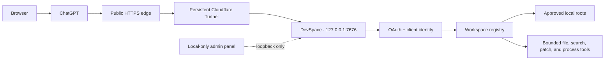

<p align="center">
  
</p>

<h1 align="center">DevSpace</h1>

<p align="center">
  <strong>Let ChatGPT safely inspect, edit, and run your approved local projects through MCP.</strong>
</p>

<p align="center">
  A production-hardened community fork focused on persistent browser workflows,<br>
  bounded resources, identity isolation, lower latency, and local administration.
</p>

<p align="center">
  <a href="https://github.com/keepkeen/devspace/blob/main/LICENSE"></a>
  
  
  
  <a href="https://github.com/Waishnav/devspace"></a>
</p>

<p align="center">
  <a href="#quick-start">Quick Start</a> ·
  <a href="#connect-chatgpt">Connect ChatGPT</a> ·
  <a href="#what-this-fork-improves">Fork Improvements</a> ·
  <a href="#security-model">Security</a> ·
  <a href="./docs/configuration.md">Configuration</a>
</p>

<p align="center">
  <a href="./docs/assets/devspace-screenshot.png">
    
  </a>
</p>

> [!IMPORTANT]
> This repository is a community fork of
> [Waishnav/devspace](https://github.com/Waishnav/devspace), based on upstream
> commit [`80423b5`](https://github.com/Waishnav/devspace/commit/80423b5).
> It is not an official upstream release. Upstream may have evolved since that
> baseline; see [What this fork improves](#what-this-fork-improves) for the
> exact scope maintained here.

## Why DevSpace?

ChatGPT cannot directly see `/Users/you/code/my-project`. Its hosted Python or
Code Interpreter environment is a different machine. DevSpace bridges that gap
with an explicit MCP tool surface:

- open only directories you allow;
- read, search, patch, and test the real local checkout;
- keep one workspace alive across long gaps between browser conversations;
- expose interactive tool cards in ChatGPT;
- retain OAuth, path, process, and resource boundaries around remote access.

DevSpace does **not** synchronize your entire repository to a hosted workspace.
Only content returned by invoked MCP tools is sent to the connected MCP host.

## Architecture



The public listener carries MCP, OAuth discovery/approval, ChatGPT app assets,
and health endpoints. The separate management panel binds to loopback, uses a
one-time capability URL, and is never mounted on the tunnel.

## Highlights

| Capability | What it gives you |
| --- | --- |
| Persistent workspaces | Reuse a checkout after minutes, hours, or later conversations; workspaces are closed only when explicitly requested. |
| Browser-first MCP tools | GPT-facing descriptions explain when to call DevSpace instead of probing a hosted sandbox. |
| Lower round-trip cost | `batch_read` and `batch_inspect` combine 2–8 independent reads/searches in one MCP call. |
| Lazy project instructions | Root instructions load immediately; nested overrides, `AGENTS.md`/`CLAUDE.md`, and configured fallback files load only when their scope is entered. |
| Identity isolation | MCP sessions, workspaces, processes, and OAuth ownership are scoped to the authorized client. |
| Hard resource bounds | MCP/process quotas, command runtime limits, output caps, idle cleanup, graceful termination, and capacity reclamation. |
| Local admin panel | Add allowed roots and configure tools, widgets, and limits without editing JSON by hand. |
| Inspectable operations | Structured JSON logs, request IDs, hashed identities, health checks, tool timing, and explicit error states. |

## Quick Start

### 1. Requirements

- Node.js `>=22.19 <27`
- npm and Git
- Bash on Linux/macOS, or Git Bash/WSL on Windows
- a tunnel client such as [cloudflared](https://developers.cloudflare.com/cloudflare-one/networks/connectors/cloudflare-tunnel/downloads/)
- a public HTTPS endpoint that forwards to `127.0.0.1:7676`
- ChatGPT access to custom MCP apps; availability currently depends on your
  ChatGPT plan and workspace settings

Use the **same Node runtime** for installation and execution because
`better-sqlite3` is a native module.

### 2. Install this fork

This fork is not published under the upstream npm package name. Build it from
source:

```bash
git clone https://github.com/keepkeen/devspace.git
cd devspace
npm ci
npm run build
```

Run the CLI directly from the checkout:

```bash
node dist/cli.js --help
```

Optionally expose `devspace` globally as a symlink to this checkout:

```bash
npm link
devspace --help
```

### 3. Initialize

```bash
node dist/cli.js init
```

The setup wizard asks for:

1. **Allowed roots** — the narrow local directories ChatGPT may open.
2. **Local port** — `7676` by default.
3. **Public base URL** — the HTTPS origin without `/mcp`.

Example:

```text
Allowed roots: /Users/alice/code,/Users/alice/work
Port: 7676
Public base URL: https://devspace.example.com
```

Configuration and the Owner password are stored separately:

```text
~/.devspace/config.json
~/.devspace/auth.json
```

Never commit or share `auth.json`.

### 4. Start DevSpace

```bash
node dist/cli.js serve
```

Verify the local service:

```bash
curl http://127.0.0.1:7676/readyz
```

Check for HTTP `200` and `"ok": true`. The response also reports lifecycle and
database checks, for example:

```json
{"ok":true,"name":"devspace","status":"ready","checks":{"lifecycle":true,"workspaceDatabase":true,"oauthDatabase":true}}
```

### 5. Expose it through HTTPS

DevSpace binds to loopback by default. A tunnel connects the public HTTPS
endpoint to the local server.

#### Fast test with Cloudflare Quick Tunnel

Keep DevSpace running in terminal 1. Start the tunnel in terminal 2:

```bash
cloudflared tunnel --url http://127.0.0.1:7676
```

Save the printed HTTPS origin. In terminal 1, stop DevSpace with `Ctrl-C`, then
update the saved URL and restart it:

```bash
node dist/cli.js config set publicBaseUrl https://random-name.trycloudflare.com
node dist/cli.js serve
```

Quick Tunnel URLs change when restarted. For an always-on ChatGPT connection,
use a named tunnel and a stable hostname.

#### Stable named Cloudflare Tunnel

```bash
cloudflared tunnel login
cloudflared tunnel create devspace
cloudflared tunnel route dns devspace devspace.example.com
```

Create `~/.cloudflared/config.yml`:

```yaml
tunnel: YOUR_TUNNEL_UUID
credentials-file: /Users/you/.cloudflared/YOUR_TUNNEL_UUID.json

ingress:
  - hostname: devspace.example.com
    service: http://127.0.0.1:7676
  - service: http_status:404
```

Start it:

```bash
cloudflared tunnel --config ~/.cloudflared/config.yml run devspace
```

Verify the complete route:

```bash
curl https://devspace.example.com/readyz
```

For long-term use, run both `devspace serve` and `cloudflared` through your OS
service manager (`launchd`, `systemd`, or an equivalent supervisor) with
automatic restart enabled.

<details>
<summary><strong>Using Shadowrocket or another TUN proxy?</strong></summary>

Route Cloudflare Tunnel endpoints directly, before generic proxy/final rules:

```text
DOMAIN,region1.v2.argotunnel.com,DIRECT
DOMAIN,region2.v2.argotunnel.com,DIRECT
DOMAIN-SUFFIX,argotunnel.com,DIRECT
IP-CIDR,198.41.192.0/24,DIRECT,no-resolve
IP-CIDR,198.41.200.0/24,DIRECT,no-resolve
IP-CIDR6,2606:4700:a0::/48,DIRECT,no-resolve
IP-CIDR6,2606:4700:a8::/48,DIRECT,no-resolve
```

Do not route the entire `198.18.0.0/15` Fake-IP range directly.

</details>

## Connect ChatGPT

> [!NOTE]
> OpenAI currently documents full custom MCP apps, including write actions, for
> ChatGPT Business and Enterprise/Edu on the web. The feature is beta and the
> UI may change. Check the current
> [OpenAI developer-mode documentation](https://help.openai.com/en/articles/12584461-developer-mode-and-mcp-apps-in-chatgpt)
> for plan and administrator requirements.

1. Enable **Developer mode** for your ChatGPT account/workspace.
2. Open **Settings → Apps → Create**. Workspace administrators can also use
   **Workspace settings → Apps → Create**.
3. Enter a name such as `Local DevSpace`.
4. Set the MCP endpoint to:

   ```text
   https://devspace.example.com/mcp
   ```

5. Select OAuth authentication when prompted.
6. Click **Scan Tools**.
7. Complete the DevSpace authorization page using the Owner password from
   `~/.devspace/auth.json`.
8. Wait for the tool scan to finish, create the app, and enable it for the
   conversation.

Try this prompt:

```text
Use DevSpace to open /Users/alice/code/my-app.
Read the applicable AGENTS.md files, inspect the project, fix the failing tests,
run the smallest relevant verification, and summarize the changed files.
```

The model should call `open_workspace` with the exact local path and reuse the
returned `workspaceId`. It should not use Code Interpreter or hosted Python to
probe that path because those tools run on a different filesystem. They remain
appropriate for work unrelated to the local workspace.

> [!TIP]
> ChatGPT may keep a frozen snapshot of an app's tool definitions. After adding
> or changing MCP tools, use the app's **Refresh/Scan Tools** action or recreate
> the draft app if your plan does not support refreshing it.

## Local Management Panel

```bash
node dist/cli.js admin
```

The panel opens a loopback-only, one-time URL. It can manage:

- allowed workspace roots;
- tool mode: `codex`, `full`, or `minimal`;
- widget mode: `full`, `changes`, or `off`;
- MCP and process-session quotas;
- command, workspace, and worktree limits;
- readiness and restart-required status.

Saving configuration does not restart the backend automatically.

## How the Model Uses DevSpace

### Workspace lifecycle

1. Call `open_workspace` once for a local project or worktree.
2. Reuse the returned `workspaceId` for later calls and later turns.
3. Reopen only if the ID is unknown or the user switches folders/modes.
4. Call `close_workspace` only when the user explicitly asks to release it.

Checkout workspaces persist across idle periods. This supports the common
browser workflow where the next conversation begins hours later.

### Tool modes

| Mode | Tools | Best for |
| --- | --- | --- |
| `codex` | `open_workspace`, `read`, `batch_read`, `batch_inspect`, `apply_patch`, `exec_command`, `write_stdin` | Compact ChatGPT/Codex-style workflow. |
| `full` | Dedicated read/write/edit/grep/glob/ls/bash tools plus batch tools | Hosts that benefit from explicit file operations. |
| `minimal` | Essential file tools, batch inspection, and bash | Smaller generic MCP surfaces. |

When 2–8 targets are already known, the server description tells the model to
prefer `batch_read` or `batch_inspect`. Iterative “inspect one result, then
choose the next target” work remains intentionally sequential.

### Project instructions

- Global and root project instructions load during `open_workspace`. Global instructions use the built-in names; each project directory prefers `AGENTS.override.md`, then `AGENTS.md`, `CLAUDE.md`, and configured fallbacks.
- Nested instruction files are discovered lazily along the canonical target
  path and cached by directory/file version.
- Literal `cd`/`pushd` targets inside shell commands participate in the same
  instruction gate; dynamic directory expressions must use `workingDirectory`
  or a literal path before execution is allowed.
- Cwd-changing shell destinations must already exist. `CDPATH`, opaque nested
  shells, and syntax that cannot be scoped safely fail closed; split directory
  creation and execution into separate calls when needed.
- New or changed scoped instructions are returned before mutations run.
- Mutating tools require the returned one-time `instructionToken` on retry,
  preventing parallel calls from racing past unseen instructions.

## What This Fork Improves

The comparison below is against upstream commit
[`80423b5`](https://github.com/Waishnav/devspace/commit/80423b5), the parent of
this fork's change set.

| Area | Upstream baseline | This fork |
| --- | --- | --- |
| Workspace lifecycle | Session lifecycle could be coupled too closely to MCP/client turnover. | Persistent checkout workspaces, explicit-only close semantics, durable ownership, clean/dirty worktree-aware closure. |
| MCP capacity | Bounded stale cleanup, but bursts of abandoned transports could still exhaust all slots. | Reservation-aware capacity reclamation, paired reclaim slots, close timeout, quarantine on failed close, and regression coverage for saturation. |
| Resource limits | Several resources relied on soft or indirect limits. | Explicit MCP/process/per-workspace quotas, resident-workspace/worktree caps, output budgets, hard command runtime, and cleanup intervals. |
| Command execution | Basic shell execution. | Foreground/background sessions, PTY support, real hard timeouts, process-tree termination, bounded retained output, and graceful shutdown. |
| `open_workspace` protocol | Workspace opening was represented too much like a read-only operation. | Correct mutating/open lifecycle annotations, stable reuse semantics, better GPT-facing instructions, and durable session restoration. |
| Identity isolation | Single-user OAuth without full ownership checks on every resource. | OAuth-client ownership for MCP sessions, workspaces, processes, refresh flows, and persisted database state. |
| Project instruction discovery | Recursive descendant scan during open, bounded only by depth/entry/deadline caps. | Immediate root load plus canonical-path lazy discovery, versioned caches, symlink checks, and instruction acknowledgement tokens. |
| ChatGPT latency | Mostly one target per file/search tool call. | Concurrent, ordered, bounded `batch_read` and `batch_inspect` tools for known independent targets. |
| GPT tool guidance | Generic MCP descriptions could lead the model to probe a hosted sandbox or close workspaces automatically. | Explicit local-filesystem workflow, correct workspace reuse/close rules, field-name guidance, batch heuristics, and Code Interpreter boundary. |
| Command safety | Shell exposed with limited workflow guidance. | Command classifier blocks high-risk patterns such as `rm -f`, `sudo`, and pipe-to-shell; canonical path confinement is applied to dedicated file operations. |
| Local administration | JSON/environment configuration only. | Loopback-only React admin panel with one-time capability, CSRF/Origin/Host checks, atomic config writes, and no automatic backend restart. |
| Observability | Basic logs. | Structured request/tool logs, request IDs, hashed client identifiers, safe command previews, readiness checks, duration/error fields, and controlled asset logging. |
| Shutdown behavior | Process exit could leave work in ambiguous states. | HTTP draining, MCP sealing/closure, process termination grace periods, timeout escalation, and readiness transitions. |
| Cross-platform process handling | Platform behavior was less explicit. | macOS/Linux/Windows-aware signaling and process-tree tests, plus native dependency/runtime diagnostics. |

The implementation is intentionally direct: ChatGPT invokes inspectable MCP
tools against approved local roots. It does not launch a second autonomous
coding agent behind the user's back.

## Security Model

DevSpace is remote access to your machine. Treat an authorized ChatGPT app as a
trusted coding collaborator.

### Enforced boundaries

- server binds to `127.0.0.1` by default;
- narrow root allowlist with canonical/symlink checks for dedicated file tools;
- Host and OAuth redirect allowlists;
- Owner-password OAuth approval;
- per-client ownership of workspaces, MCP sessions, and processes;
- bounded sessions, command runtime, output, and retained resources;
- local admin panel is not exposed through the MCP listener;
- secrets and raw OAuth tokens are excluded from normal logs.

### Important shell boundary

`exec_command`/`bash` run with the DevSpace OS user's permissions. The file-tool
allowlist is **not an OS sandbox for arbitrary shell commands**. If you require
hard filesystem confinement, run DevSpace under a dedicated OS account or in a
container/VM with only approved roots mounted.

Recommended practices:

1. Allow the narrowest possible roots.
2. Keep `~/.devspace/auth.json` and tunnel credentials private.
3. Do not expose the local admin port publicly.
4. Use a dedicated hostname and TLS tunnel.
5. Run under a dedicated OS account for higher-risk or multi-user deployments.
6. Review ChatGPT write confirmations and the returned diffs.

Read the complete [security model](./docs/security.md).

## Configuration

Common commands:

```bash
node dist/cli.js doctor
node dist/cli.js config get
node dist/cli.js config set publicBaseUrl https://devspace.example.com
node dist/cli.js config set toolMode codex
node dist/cli.js admin
```

Common environment variables:

| Variable | Default | Purpose |
| --- | --- | --- |
| `HOST` | `127.0.0.1` | Local bind address. |
| `PORT` | `7676` | Local MCP/admin-independent server port. |
| `DEVSPACE_ALLOWED_ROOTS` | — | Comma-separated approved workspace roots. |
| `DEVSPACE_PUBLIC_BASE_URL` | — | Public HTTPS origin without `/mcp`. |
| `DEVSPACE_TOOL_MODE` | `codex` | `codex`, `full`, or `minimal`. |
| `DEVSPACE_WIDGETS` | `full` | `full`, `changes`, or `off`. |
| `DEVSPACE_MAX_MCP_SESSIONS` | `64` | Maximum live MCP transports. |
| `DEVSPACE_MAX_PROCESS_SESSIONS` | `32` | Maximum retained process sessions. |
| `DEVSPACE_MAX_COMMAND_RUNTIME_SECONDS` | `3600` | Hard upper runtime for a command. |

See the full [configuration reference](./docs/configuration.md).

## Troubleshooting

<details>
<summary><strong>ChatGPT says the local tool is disabled</strong></summary>

- Confirm the custom app is enabled in the current chat.
- Verify `https://your-host/mcp` is the configured endpoint.
- Run `curl https://your-host/readyz`.
- Refresh/rescan the app tools after server changes.
- Complete OAuth approval again if authorization expired.

</details>

<details>
<summary><strong><code>better-sqlite3</code> cannot load</strong></summary>

The install and service are using different Node ABIs. Rebuild with the same
Node executable used to run DevSpace:

```bash
npm rebuild better-sqlite3
node dist/cli.js doctor
```

</details>

<details>
<summary><strong>Public endpoint returns 502</strong></summary>

Check the local origin first:

```bash
curl http://127.0.0.1:7676/readyz
```

If local readiness fails, inspect DevSpace logs. If local readiness succeeds,
inspect `cloudflared` logs and confirm the ingress points to
`http://127.0.0.1:7676`.

</details>

<details>
<summary><strong>Tool calls are slow</strong></summary>

- Prefer `batch_read`/`batch_inspect` once multiple targets are known.
- Keep `cloudflared` on its default `auto` transport unless measurements show
  HTTP/2 is more stable than QUIC on your network.
- Ensure VPN/TUN software routes `argotunnel.com` directly when appropriate.
- Compare local `/readyz` latency with the public `/readyz` route.

</details>

More cases are documented in [Troubleshooting Gotchas](./docs/gotchas.md).

## Development

```bash
npm ci
npm run dev
npm run typecheck
npm test
npm run build
```

Before publishing a change:

```bash
npm run typecheck
npm test
npm run build
git diff --check
```

## Documentation

- [Setup Guide](./docs/setup.md)
- [ChatGPT Coding Workflow](./docs/chatgpt-coding-workflow.md)
- [Configuration Reference](./docs/configuration.md)
- [Security Model](./docs/security.md)
- [Troubleshooting](./docs/gotchas.md)

## Upstream and Attribution

DevSpace was created by [Waishnav](https://github.com/Waishnav). This fork keeps
the original project history, assets, and MIT license while maintaining a
separate browser-persistence, security-hardening, latency, and administration
change set.

- Upstream: [Waishnav/devspace](https://github.com/Waishnav/devspace)
- Enhanced fork: [keepkeen/devspace](https://github.com/keepkeen/devspace)
- Baseline commit: [`80423b5`](https://github.com/Waishnav/devspace/commit/80423b5)

If a change is broadly useful and compatible with upstream direction, consider
proposing it upstream separately after review.

## License

[MIT](./LICENSE) © Waishnav and contributors. Fork modifications remain under
the same license.
