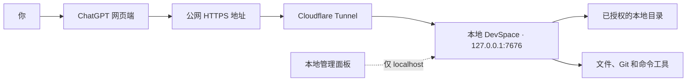

<p align="center">
  <strong>简体中文</strong> · <a href="./README_EN.md">English</a>
</p>

<p align="center">
  
</p>

<h1 align="center">DevSpace</h1>

<p align="center">
  <strong>让 ChatGPT 直接读取、修改和测试你电脑上的项目。</strong>
</p>

<p align="center">
  DevSpace 把你授权的本地目录转换成安全、可检查的 MCP 工具。<br>
  ChatGPT 操作的是真实本地文件，不需要把整个仓库上传到云端沙箱。
</p>

<p align="center">
  <a href="https://github.com/keepkeen/devspace/blob/main/LICENSE"></a>
  
  
  
</p>

<p align="center">
  <a href="#快速开始">快速开始</a> ·
  <a href="#连接-chatgpt">连接 ChatGPT</a> ·
  <a href="#怎么使用">怎么使用</a> ·
  <a href="#推荐的项目组织">项目组织</a> ·
  <a href="#这个分支改进了什么">分支亮点</a> ·
  <a href="#安全边界">安全边界</a>
</p>

<p align="center">
  <a href="./docs/assets/devspace-screenshot.png">
    
  </a>
</p>

> [!IMPORTANT]
> 这是 [Waishnav/devspace](https://github.com/Waishnav/devspace) 的社区增强分支，
> 基于上游提交
> [`80423b5`](https://github.com/Waishnav/devspace/commit/80423b5)。
> 本仓库不是上游官方版本。

## DevSpace 是什么？

ChatGPT 运行在云端，正常情况下无法打开你电脑上的
`/Users/alice/code/my-app`。Code Interpreter 和网页版 Python 也运行在另一台
机器上，所以把本地路径发给它们是没有用的。

DevSpace 在你的电脑上启动一个轻量 MCP 服务。授权目录之后，ChatGPT 可以：

- 读取文件和搜索代码；
- 修改文件和应用补丁；
- 运行测试、Lint、构建和其他命令；
- 查看 Git 变更；
- 遵守 `AGENTS.md`、`CLAUDE.md` 和本地 Skill；
- 在对话结束或网络重新连接后继续使用同一个 workspace。

在普通工作流中，DevSpace 只是工具服务，不是另一个隐藏的编码模型。由
ChatGPT 自己决定调用哪些工具，每次调用都会显示在对话中。项目也提供可选的
本地子代理功能，但默认关闭。

专用文件工具只能打开允许列表中的目录。DevSpace 不会提前上传整个仓库；只有
工具调用实际返回的内容会发送给 MCP 客户端。

## 工作原理



公网地址用于传输 MCP 和 OAuth 请求。管理面板只监听本机地址，不会暴露到
Tunnel 上。

## 快速开始

### 环境要求

- Node.js `>=22.19 <27`
- npm 和 Git
- macOS/Linux 上的 Bash，或者 Windows 上的 Git Bash/WSL
- 一个公网 HTTPS Tunnel，例如
  [Cloudflare Tunnel](https://developers.cloudflare.com/cloudflare-one/connections/connect-networks/)
- 允许开启开发者模式的 ChatGPT 账号或工作区

安装依赖、构建项目和启动服务时应使用同一套 Node.js。DevSpace 使用原生模块
`better-sqlite3`，不同 Node ABI 之间不能直接混用。

### 1. 安装这个分支

```bash
git clone https://github.com/keepkeen/devspace.git
cd devspace
npm ci
npm run build
```

下面的教程直接从当前仓库运行 CLI：

```bash
node dist/cli.js --help
```

如果你更喜欢简短的 `devspace` 命令：

```bash
npm link
devspace --help
```

### 2. 初始化配置

```bash
node dist/cli.js init
```

初始化向导主要询问三项内容：

1. **允许访问的根目录**：例如 `/Users/alice/code`。ChatGPT 只能通过专用
   文件工具打开这些目录。
2. **本地端口**：默认是 `7676`。
3. **公网地址**：你的 HTTPS Tunnel 地址，不包含 `/mcp`。

普通配置和 Owner 密码分开保存：

```text
~/.devspace/config.json
~/.devspace/auth.json
```

不要分享或提交 `auth.json`。任何拿到 Owner 密码的人都可以批准新的 MCP 客户端。

### 3. 启动 DevSpace

```bash
node dist/cli.js serve
```

保持服务运行，在另一个终端检查本地状态：

```bash
curl http://127.0.0.1:7676/readyz
```

健康状态会返回 HTTP `200`，JSON 中包含：

```json
{"ok":true,"name":"devspace","status":"ready"}
```

也可以运行安装诊断：

```bash
node dist/cli.js doctor
```

### 4. 启动 HTTPS Tunnel

临时测试可以直接运行：

```bash
cloudflared tunnel --url http://127.0.0.1:7676
```

Cloudflare 会打印一个临时地址，例如：

```text
https://random-name.trycloudflare.com
```

保存该地址，然后重新启动 DevSpace：

```bash
node dist/cli.js config set publicBaseUrl https://random-name.trycloudflare.com
node dist/cli.js serve
```

检查完整公网链路：

```bash
curl https://random-name.trycloudflare.com/readyz
```

Quick Tunnel 每次重启都可能更换地址。日常使用建议创建带固定域名的 Named
Tunnel：

```bash
cloudflared tunnel login
cloudflared tunnel create devspace
cloudflared tunnel route dns devspace devspace.example.com
```

`~/.cloudflared/config.yml` 示例：

```yaml
tunnel: YOUR_TUNNEL_UUID
credentials-file: /Users/you/.cloudflared/YOUR_TUNNEL_UUID.json

ingress:
  - hostname: devspace.example.com
    service: http://127.0.0.1:7676
  - service: http_status:404
```

启动 Named Tunnel：

```bash
cloudflared tunnel --config ~/.cloudflared/config.yml run devspace
```

最后保存固定公网地址：

```bash
node dist/cli.js config set publicBaseUrl https://devspace.example.com
```

## 连接 ChatGPT

OpenAI 目前把自定义 MCP 集成称为 **developer-mode app（开发者模式应用）**。
产品界面可能继续变化，最新入口请参考 OpenAI 官方的
[Connect from ChatGPT](https://developers.openai.com/apps-sdk/deploy/connect-chatgpt)。

1. 打开 ChatGPT 的 **Settings → Security and login**，开启
   **Developer mode**。组织账号可能需要管理员先允许该功能。
2. 打开 **Settings → Plugins**，或者直接访问
   [chatgpt.com/plugins](https://chatgpt.com/plugins)。
3. 新建一个 developer-mode app。
4. 填写容易理解的名称和说明，例如 `Local DevSpace`。
5. MCP 地址填写完整的 `/mcp` URL：

   ```text
   https://devspace.example.com/mcp
   ```

6. 创建应用并检查 ChatGPT 扫描到的工具列表。
7. 在 DevSpace OAuth 页面输入 `~/.devspace/auth.json` 中的 Owner 密码。
8. 新建 ChatGPT 对话，点击输入框附近的 **+**，选择 **More**，然后把
   DevSpace 应用添加到当前对话。

如果 DevSpace 新增或修改了工具，请在 ChatGPT 的 **Settings → Plugins** 中
打开该应用并选择 **Refresh**。只重启本地服务不会自动更新 ChatGPT 缓存的工具
定义。

## 怎么使用

第一次连接项目时，在提示词里明确要求使用 DevSpace，并给出准确的本地路径和一个
容易记忆的别名：

```text
使用 DevSpace 把 /Users/alice/code/my-app 打开为别名 my-app。
先阅读项目指令，找出失败的测试并修复，运行最小范围的验证，
最后总结修改了哪些文件。
```

正常的调用流程是：

1. ChatGPT 用用户批准的本地路径和别名调用 `open_workspace`。默认只完成选择并返回
   `state.phase: "selected"`。如果用户已经明确指定项目，而且当前任务确实需要仓库上下文，
   第一次调用可直接使用 `contextMode: "full"`。
2. selected Workspace 通过 `get_workspace_context(contextMode: "full")` 加载根上下文。
   v5 full context 返回 `instructionManifest` 和 Skill 目录，不返回 AGENTS 正文；
   `state.phase` 变为 `context_loaded`。只有刷新同一份已保留上下文时才使用
   `contextMode: "retained"` 和 revision 提示。
3. 准备处理具体路径时调用 `load_workspace_instructions(paths)`。它只返回对这些路径生效的
   指令链，并在需要时返回一次性 `instructionToken`；上下文推进到 `target_scoped`。
   修改或执行工具必须把该 token 用于对应操作。
4. ChatGPT 风格 host 会把 Workspace 绑定到
   `(principal, HMAC(openai/session))`，普通文件和进程工具不需要模型重复传 receipt。
   没有 `openai/session` 的通用 MCP client 使用当前 `wctx5` receipt。显式传入无效 receipt
   永远不会回退到 host session。普通工具只返回 `workspaceAlias`、
   `contextChanged: false` 和工具自身结果；只有 lifecycle、revision、generation 或 phase
   变化时才返回 continuation。
5. 新对话、上下文丢失或服务重启后先调用 `list_workspaces`，再按一个 alias 或
   `workspaceRef` 调用 `resume_workspace`。如果 principal 没有 retained Workspace，才重新
   `open_workspace` 用户批准的路径。错误结果会用 `recovery: "list_then_resume"` 或
   `open_workspace_full` 明确区分。只有用户明确要求释放时才调用 `close_workspace`。

如果删除并重新添加 ChatGPT 应用，新的 Owner 授权会创建新的 authorization grant 和
connection principal，因此默认看不到旧 alias。需要恢复旧 principal 时，在本机使用
`devspace auth reconnect-code <principal-id>`，并在授权页输入一次性代码。
服务重启会使进程内 receipt 和 host session binding 失效，但持久化 alias/Workspace 仍可恢复。
managed worktree 路径丢失时，alias 保留为 `recovery_required`；无法恢复的未提交内容会以
`dataLossPossible=true` 明示。

新建 checkout 默认只读。需要直接修改当前 checkout 时，明确使用
`writeAccess: "read_write"`；更推荐使用 `mode: "worktree"` 获得隔离的可写工作区。
从 1.x 迁移的 checkout 会把历史权限显式写入 v15 数据库；新 checkout 仍默认只读。

不要让 ChatGPT 使用云端 Python 或 Code Interpreter 去检查本地路径。它们仍可
用于与本地项目无关的计算和数据处理；本地项目操作应通过 DevSpace 完成。

### 连接主体不是 ChatGPT 账户身份

DevSpace 看不到经过验证的 ChatGPT 账户 `sub`。OAuth `client_id` 只标识动态注册，
授权主体绑定到每一次 authorization grant：grant 固定保存 principal、能力集合和
authorization epoch，access/refresh token 直接引用该 grant。刷新 token 沿用原 grant，
不会通过 `clientId` 临时寻找 principal。

工具调用可携带 `openai/subject`、`openai/organization` 和 `openai/session`。服务端只保存
带用途分离的 HMAC，用于 grant 一致性、匿名审计/限流和 host session 绑定；这些字段不是
授权凭证，也不会取代 OAuth token。新的注册只有使用一次性 reconnect code 才能显式连接到
旧 principal。

不同 principal 仍可能打开同一物理 checkout。DevSpace 使用跨进程的 canonical-root 读写锁：
读取可并发，补丁、命令、可写进程交互、checkpoint 推进、关闭和撤销串行。返回后台进程时，
写租约会持续到完整进程树退出。外部编辑器不受该锁控制，所以 `ifMatch` 仍然是所有补丁的
强制前置条件；并行写任务仍优先使用独立 Git worktree。

### OAuth 能力范围

DevSpace 支持 `workspace:read`、`workspace:write`、`process:execute`、
`network:access`、`worktree:create` 和 `workspace:revoke`。授权请求省略 scope 时只授予
`workspace:read`；更高权限必须显式请求。tools/list 会按当前 grant 的能力动态隐藏不可用工具，
handler 仍会再次校验权限，旧缓存 schema 不能绕过授权。2.0 不接受模糊的 `devspace`
全权限 scope。

### `AGENTS.md` 和 Skill

`open_workspace/full`、`resume_workspace/full` 和 `get_workspace_context/full` 采用
manifest-first：`instructionManifest.files[]` 只包含来源、信任、作用域、相对路径、哈希和
UTF-8 字节数，不让仓库指令正文长期驻留在整个对话中。准备处理具体路径时，
`load_workspace_instructions(paths)` 才返回适用链的正文、`reviewedRevision` 和一次性 token。
字段 `loadedForScope` 表示服务端确认该 revision 已被返回，不表示模型“同意服从”。仓库指令
始终是 `repository_untrusted`，不能覆盖用户意图或 DevSpace 安全策略。

用户级指令必须通过管理面板或 `DEVSPACE_USER_INSTRUCTIONS_PATH` 显式配置；默认不会读取
`~/.codex/AGENTS.md`。指令链总预算为 32 KiB，空白候选会跳过。读取进入新作用域时只提示
`scopedInstructionsAvailable=true`；修改、命令及可能改变目录的交互输入都经过同一指令门禁。

Skill 使用独立 revision。`list_skills` 提供有界搜索和分页，`load_skill` 按 `skillId`
显式加载正文；支持文件通过 `skill://` 路径读取，不暴露本机绝对路径。仓库 Skill 始终
`repository_untrusted` 且默认 `explicitOnly=true`，仓库不能自行提升信任。
详细规则见[ChatGPT 编码工作流](./docs/chatgpt-coding-workflow.md)。

### 固定工具协议

DevSpace 暴露稳定但按 OAuth capability 过滤的工具集合。默认只读 grant 的 tools/list 保持在
12 KB 内；完整能力 profile 才暴露写入、进程、网络、worktree 和撤销工具。lifecycle 工具具有
统一的版本化 output schema：`schemaVersion: 1`、`ok`、`workspace`、三阶段 `state`、
`contextChanged` 和结构化 `error`。Workspace context 自身使用 `contextSchemaVersion: 5`。

ChatGPT host 的普通工具依赖服务端 session binding；通用 MCP client 传 `wctx5` receipt。
`workspaceId` 和 generation 是结果标识，不是授权句柄。普通结果不回显 continuation；
只有 context、revision、generation 或 phase 变化才返回新的 continuation。receipt 默认 6 小时、
进程内有效，访问不会滑动延期。

`exec_command` 优先使用 `program` + `args`，只有需要 shell 语法时才使用
`shell: true` + `command`。运行时会公布 `runtimeCapabilities`；当前默认环境没有
per-process 网络隔离、进程 sandbox，文件隔离是 guardrail-only，因此 schema 不广告必然失败的
`network: "deny"`。授权页也会明确这些风险。

`apply_patch`、`exec_command`、`close_workspace` 和 `revoke_workspace` 必须使用
`operationId`；可写 `write_stdin` 和显式 checkpoint 推进也一样。`read` 返回
`contentHash`/`mtimeNs`，补丁对每个 touched path 都要求 `ifMatch`，新文件使用 `null`。
失败统一返回 `code`、`phase`、`safeToRetry`、`effectsKnown` 和机器可读 recovery。

`batch_inspect` 的 grep 支持 `path/include/limit/context/ignoreCase/literal`，glob 和 ls
也支持 limit。批处理先给每项保留最小预算，再 round-robin 分配剩余预算；没有空间的 item
返回 `omittedReason: "aggregate_budget_exhausted"`，read 保留 `nextOffset`，搜索结果给出
继续缩小范围或增加 limit 的提示。

## 推荐的项目组织

DevSpace 的持久化单位是 **connection principal 下的 Workspace alias**。最稳定的
使用方式是：一个 Git 项目一个目录、一个持续任务一个 alias、需要并行隔离时一个
managed worktree。不要把整个 Home 目录当成项目根。

推荐结构：

```text
~/code/                              # DevSpace allowed root
├── billing-api/                     # 一个独立 Git 项目
│   ├── AGENTS.md                    # 简短、稳定、适用于整个仓库的规则
│   ├── docs/
│   │   └── agent-architecture.md    # 详细背景资料，不塞进根指令
│   ├── services/
│   │   └── payments/
│   │       └── AGENTS.md            # 只作用于该子目录的增量规则
│   ├── .agents/
│   │   └── skills/
│   │       └── release-check/
│   │           ├── SKILL.md         # 仓库 Skill，默认 explicit-only
│   │           └── references/
│   └── package.json
└── mobile-app/                      # 另一个项目，使用另一个 alias

~/.agents/skills/                    # 个人可信 Skill，不属于任何仓库
└── company-review/
    └── SKILL.md
```

建议按下面的方式选择 Workspace：

| 需求 | 建议做法 |
| --- | --- |
| 隔天继续同一任务 | `list_workspaces` 后恢复原 alias，不重新发送路径。 |
| 新对话继续原任务 | 恢复同一个 alias；两个对话会看到同一个 Workspace 状态。 |
| 同一仓库开启独立新任务 | 使用新的 managed worktree 和新 alias，例如 `billing-api-auth-fix`。 |
| 只审查当前 checkout | 使用默认只读 checkout，不授予写权限。 |
| 两个账号或 principal 并行修改同一仓库 | 使用两个 managed worktree；不要共享同一个可写 checkout。 |
| 同时处理多个项目 | 每个项目保留独立 alias；不要让一个对话在多个 alias 之间来回漂移。 |

项目本身建议遵循这些规则：

1. **Allowed root 只放项目集合。** 推荐授权 `~/code`、`~/work` 之类的目录，
   不要授权 `~`、`/`、云盘根目录或包含大量私人文件的目录。
2. **Git 仓库先有一个基线提交。** managed worktree 需要有效提交；重要阶段及时
   commit。物理 worktree 丢失时，DevSpace 能恢复已提交内容，不能保证恢复随目录
   一同消失的未提交文件。
3. **根 `AGENTS.md` 保持短小。** 只写构建命令、测试要求、架构边界和禁止事项。
   详细设计放入 `docs/`；子系统规则放在对应目录的嵌套 `AGENTS.md`。完整有效指令链
   上限为 32 KiB，越短越不容易挤占模型上下文。
4. **Skill 按信任来源分层。** 仓库 Skill 默认不可信且必须显式加载；个人或管理员
   可信 Skill 放在用户/Admin Skill 根。只有确实需要隐式选择时，才把精确 Skill
   目录加入 `DEVSPACE_SKILL_PATHS`。description 保持一行，长资料放入 `references/`。
5. **不要把秘密写进指令或 Skill。** Token、SSH key、云凭据和私有环境变量应留在
   系统密钥链或进程环境中；只有命令明确需要时才通过受控环境覆盖传入。
6. **生成物留在项目内。** `dist`、`coverage`、缓存和临时测试输出放在仓库目录中并
   加入 `.gitignore`，这样正常清理命令不会碰到 Workspace 外部路径。
7. **Monorepo 默认打开仓库根。** 用嵌套指令描述 package 差异。只有某个子项目需要
   独立权限、独立生命周期或完全不同的任务历史时，才单独打开子目录。
8. **对话分支不是 Git 分支。** ChatGPT 的对话分支会复制 receipt，但仍指向同一个
   Workspace。需要文件级隔离时必须创建 managed worktree。

## 保持长期在线

要让 ChatGPT 随时连接到本地，需要同时保持两个进程运行：

```text
DevSpace 服务  +  HTTPS Tunnel
```

建议用 `launchd`、`systemd` 等系统服务管理器运行它们，开启自动重启，并使用
固定 Tunnel 域名。ChatGPT 对话结束不会自动关闭本地 workspace；workspace
状态保存在 SQLite 中，不依赖某一条 HTTP 连接。

服务重启后，ChatGPT 可能创建新的 MCP 传输会话。已持久化的 checkout
workspace 不会丢失，但旧 receipt 会失效；模型应先 `list_workspaces`，再用
alias 或 `workspaceRef` 调用 `resume_workspace` 并使用 `contextMode: "full"` 取得新 receipt。

<details>
<summary><strong>小火箭或其他 TUN 代理</strong></summary>

把以下 Cloudflare Tunnel 直连规则放在通用代理和 FINAL 规则之前：

```text
DOMAIN,region1.v2.argotunnel.com,DIRECT
DOMAIN,region2.v2.argotunnel.com,DIRECT
DOMAIN-SUFFIX,argotunnel.com,DIRECT
IP-CIDR,198.41.192.0/24,DIRECT,no-resolve
IP-CIDR,198.41.200.0/24,DIRECT,no-resolve
IP-CIDR6,2606:4700:a0::/48,DIRECT,no-resolve
IP-CIDR6,2606:4700:a8::/48,DIRECT,no-resolve
```

不要把整个 `198.18.0.0/15` Fake-IP 网段设为直连。

</details>

## 本地管理面板

```bash
node dist/cli.js admin
```

DevSpace 会打开一个仅限 localhost、带一次性令牌的管理地址。面板可以：

- 添加和删除允许访问的目录；保存后热更新，无需重启；
- 选择结果卡片模式和用户级说明文件；
- 设置 MCP、进程、workspace、命令和 worktree 配额；
- 查看后端、Tunnel、配额和最近失败状态；
- 下载经过脱敏的诊断报告；
- 一键撤销所有 OAuth 客户端和 Token；
- 重启明确授权的 macOS `launchd` 后端，并验证新 PID 和 readiness generation。

保存配置不会偷偷重启后端。允许访问的目录会立即热更新：新增目录马上可用，
移除目录会使相关 workspace 失效并终止其运行命令。其他影响运行服务的配置仍需重启。在
macOS 上，只有明确授权的 `launchd` 服务才能由管理面板重启，例如：

```bash
DEVSPACE_LAUNCHD_SERVICE_LABEL=com.waishnav.devspace node dist/cli.js admin
```

管理面板不会启动、接管或结束任意 `cloudflared` 进程。Tunnel 控制目前只显示
状态，不执行启停操作。

## 这个分支改进了什么？

上游项目验证了“通过 MCP 访问本地 workspace”这条路线。本分支重点解决日常
使用 ChatGPT 网页端时的持久性、安全性、速度和管理问题。

以下对比基于上游提交
[`80423b5`](https://github.com/Waishnav/devspace/commit/80423b5)。

| 方面 | 这个分支的改进 |
| --- | --- |
| 对话与项目连续性 | Workspace 不绑定短暂 MCP transport。alias、`workspaceRef` 和 HMAC `projectFingerprint` 可见；同一连接的多个对话可分别保留多个项目，隔天或新 transport 后精确恢复。 |
| worktree 恢复 | managed worktree 路径丢失时不创建无穷新分支；原 Workspace ID/alias 保留为 `recovery_required`，恢复时优先使用 Git worktree metadata 中的最新提交，并明确标记未提交数据风险。 |
| 稳定授权主体 | OAuth principal 绑定 authorization grant 而不是 client；authorization code、access token 和 refresh token 固定携带 grant/principal/epoch。一次性 reconnect code 可显式恢复旧 principal。不同 principal 不能复用 Workspace、进程、输出或 operation ID。 |
| 细粒度 OAuth | 省略 scope 时只授予 `workspace:read`；六类能力分别校验并动态裁剪 tools/list。匿名 subject/organization HMAC 只做 grant 一致性与审计，不能替代 OAuth token。 |
| Host session binding | ChatGPT 风格宿主通过 HMAC `openai/session` 服务端绑定 Workspace/context；普通调用不重复 receipt。通用 MCP client 使用 v5 receipt，显式无效 receipt 不会回退。 |
| 公平 receipt 缓存 | receipt 有全局和单 principal 配额，过期记录先清理，LRU 使用不滑动固定 TTL，避免一个连接挤掉其他连接的上下文。 |
| 紧凑模型上下文 | `selected/context_loaded/target_scoped`、manifest-first 指令、explicit-only Repository Skill、按能力裁剪工具和精简 ordinary envelope 控制上下文；默认只读 tools/list 持续限制在 12 KB 内。 |
| 文件一致性 | `read` 与 `batch_read` 共用读前/读后版本校验并返回 `contentHash`/`mtimeNs`；`apply_patch` 对每个 touched path 强制完整 `ifMatch`，不存在 blind write。 |
| 幂等 mutation | 写入、命令、可写进程输入、生命周期和 checkpoint 推进使用持久 operation ID。响应丢失时可重放结果，不会重复执行；未知结果不会自动重跑。 |
| 变更预览做减法 | 只要授权包含 `workspace:read`，`show_changes` 始终出现在工具表中；Widget 开关只控制 UI。默认预览不要求 write scope 或 operation ID，也不推进 checkpoint；只有显式 `advanceCheckpoint` 才成为幂等写操作。 |
| 命令与进程边界 | 普通 build/test/Git/package 命令和项目内清理可正常执行；Workspace 外写入、根目录删除、受保护状态、`sudo` 和远程内容 pipe-to-shell 被阻止。后台进程持有同根写租约直到完整进程树退出。 |
| 进程输出 | 命令正文位于模型可见的结构化 `output.text`，分页正文位于 `page.text`；有持久输出时始终返回 `outputId`。命令还有硬超时、终止宽限和资源配额，输出所有权同时绑定 principal 和 Workspace。 |
| 指令门禁 | Full context 只返回 manifest；具体目标通过 `load_workspace_instructions(paths)` 获取适用正文、reviewed revision 和一次性 token。仓库指令始终是 untrusted data，全链限制为 32 KiB。 |
| Skill 信任边界 | Repository Skill 永远是 `repository_untrusted`、默认 explicit-only，不能通过自身 metadata 提权；catalog description 会清洗控制字符/HTML/代码块，正文与固定服务端文本分离。 |
| 同根并发协调 | 跨进程 canonical-root 锁允许并行读取并串行化写调用；运行中的后台进程继续持锁，外部编辑器则由严格 `ifMatch` 防止静默覆盖。 |
| 撤销和清理 | revoke/close 先阻止新调用、终止受跟踪进程并排空活动请求；持久化清理任务在崩溃后继续。干净 worktree 可删除，脏 worktree 保留为可审计结果。 |
| 管理与可观测性 | localhost 管理面板支持热更新 allowed roots、配额、脱敏诊断和受控服务重启；日志使用 `connectionRef`、`oauthClientRef` 和 `workspaceActivityRef`，不记录原始 Token 或主机路径。 |
| 发布供应链 | Claude/Pi 改用用户已安装的 CLI，不再为未启用 provider 强制安装 Claude/Pi/Google SDK；基础文件工具由本地纯 Node 实现。MCP SDK 以已审计依赖树打包，minimatch/brace 固定为安全版本，规避上游 Hono 1.x advisory。`test:pack` 在全新消费者项目中默认安装 tarball、运行 CLI/SQLite/服务烟测并强制 `npm audit --omit=dev` 为 0。 |

## 安全边界

DevSpace 允许远程模型在受控范围内访问你的电脑。请把已授权的 ChatGPT 应用
当成一个拥有当前 DevSpace 系统用户权限的编码协作者。

DevSpace 会强制执行：

- 专用文件工具的目录允许列表；
- 真实路径和符号链接检查；
- OAuth 授权和 connection principal 资源所有权；
- Host 与 OAuth 重定向地址允许列表；
- MCP 会话、进程、输出和命令时间限制；
- 只监听 localhost 的管理面板；
- 明确的写操作标注和 ChatGPT 确认流程。

> [!WARNING]
> `exec_command` 使用运行 DevSpace 的系统用户权限。文件工具的目录
> 允许列表并不是任意 shell 命令的操作系统级沙箱。如果需要强隔离，请使用
> 专用系统账号，或者把 DevSpace 放进只挂载授权目录的容器/虚拟机中运行。

推荐做法：

1. 只授权真正需要的最小目录。
2. 保护好 `~/.devspace/auth.json` 和 Tunnel 凭据。
3. 不要把本地管理面板暴露到公网 Tunnel。
4. 使用 TLS 和固定域名。
5. 检查 ChatGPT 的写操作确认和 Git Diff。
6. 高风险或多用户环境使用专用系统账号。

完整说明见[安全模型](./docs/security.md)。

## 配置

常用命令：

```bash
node dist/cli.js init
node dist/cli.js doctor
node dist/cli.js config get
node dist/cli.js config set publicBaseUrl https://devspace.example.com
node dist/cli.js admin
```

常用环境变量：

| 变量 | 默认值 | 用途 |
| --- | --- | --- |
| `HOST` | `127.0.0.1` | 本地监听地址。 |
| `PORT` | `7676` | 本地 MCP 服务端口。 |
| `DEVSPACE_ALLOWED_ROOTS` | — | 逗号分隔的授权目录。 |
| `DEVSPACE_PUBLIC_BASE_URL` | — | 不带 `/mcp` 的公网 HTTPS 地址。 |
| `DEVSPACE_WIDGETS` | `full` | `full`、`changes` 或 `off`。 |
| `DEVSPACE_MAX_MCP_SESSIONS` | `64` | MCP 会话全局上限。 |
| `DEVSPACE_MAX_PROCESS_SESSIONS` | `32` | 保留进程会话的全局上限。 |
| `DEVSPACE_MAX_PROCESS_OUTPUT_FILE_BYTES` | `67108864` | 单个进程完整输出的持久化上限（64 MiB）。 |
| `DEVSPACE_MAX_PROCESS_OUTPUT_STORAGE_BYTES` | `1073741824` | 所有持久化进程输出的总上限（1 GiB）。 |
| `DEVSPACE_COMPLETED_PROCESS_OUTPUT_TTL_SECONDS` | `86400` | 已完成进程输出的保留时间（24 小时）。 |
| `DEVSPACE_MAX_COMMAND_RUNTIME_SECONDS` | `3600` | 命令硬超时时间。 |

完整选项见[配置参考](./docs/configuration.md)。

## 常见问题

<details>
<summary><strong>ChatGPT 提示本地工具已被禁用</strong></summary>

- 确认当前对话已经添加 DevSpace 应用。
- 确认配置的 URL 以 `/mcp` 结尾。
- 运行 `curl https://your-host/readyz`。
- 修改工具后，在 ChatGPT Plugin 设置里刷新应用。
- 如果客户端或 Token 已被撤销，重新完成 OAuth 授权。

</details>

<details>
<summary><strong>公网地址返回 502</strong></summary>

先检查本地服务：

```bash
curl http://127.0.0.1:7676/readyz
```

如果本地正常，再检查 `cloudflared` 日志，并确认 ingress 指向
`http://127.0.0.1:7676`。

</details>

<details>
<summary><strong><code>better-sqlite3</code> 无法加载</strong></summary>

安装依赖和运行服务使用的 Node.js ABI 可能不同：

```bash
npm rebuild better-sqlite3
node dist/cli.js doctor
```

</details>

<details>
<summary><strong>工具调用很慢</strong></summary>

- 已知多个独立目标后，使用 `batch_read` 或 `batch_inspect`。
- 分别测试本地和公网 `/readyz` 延迟。
- 如果使用 VPN/TUN 代理，让 Cloudflare Tunnel 相关地址按需直连。
- 长时间测试或构建属于命令执行时间，并不一定是 MCP 传输慢。

</details>

更多内容见[故障排查](./docs/gotchas.md)。

## 从 1.x 升级到 2.0

2.0 是一次明确的协议和数据库切换。升级前先在系统服务管理器中停止 DevSpace，
然后复制整个 state directory（默认 `~/.local/share/devspace`）作为离线备份。
不要只复制主数据库：process-output 元数据也会升级。

首次启动 2.0 时：

- 主 `devspace.sqlite` 会在临时文件中转换为唯一的 canonical v15 schema，完成
  integrity/foreign-key 校验后再原子替换；原文件保留为
  `devspace.sqlite.pre-v15.<timestamp>.bak`。
- 历史 `devspace` Token scope 只在迁移时展开为六个明确能力；2.0 运行时不再
  接受该 scope。
- OAuth client 会迁移为独立 grant；token 固定关联 grant、principal 和 authorization epoch。
- Workspace 会补齐 principal、alias、canonical root、write access 和 generation；
  不存在的 checkout 会关闭，同 principal 的重复 active checkout 只保留一个。
- mutation replay 会移除旧 receipt/continuation 快照；claimed cleanup job 会回到
  可重试的 pending 状态。
- `process-output/metadata.sqlite` 从 v2 事务迁到 v3，所有权列统一为
  `connection_principal_id`。

数据库迁移成功后，在 ChatGPT 的 DevSpace 应用设置中执行 **Refresh**。1.x 的
`workspaceId`/generation、`cmd`/`cwd` 和 `devspace` scope 请求不会被兼容执行。

需要回滚时，先停止 2.0，恢复升级前复制的**整个 state directory**，再安装并启动
原 1.x 版本。只恢复主数据库备份不足以回滚 process-output v3。确认回滚服务可用后，
再次刷新 ChatGPT 中的工具定义。


## 开发

```bash
npm ci
npm run dev
npm run typecheck
npm test
npm run test:browser
npm run build
npm run test:pack
```

`test:pack` 不只是生成 tarball：它会在全新临时消费者项目中安装发布包，运行
CLI、SQLite 和服务启动烟测，并执行生产依赖审计。任何消费者可见漏洞都会让发布门禁失败。

## 文档

- [安装指南](./docs/setup.md)
- [ChatGPT 编码工作流](./docs/chatgpt-coding-workflow.md)
- [真实 ChatGPT 宿主验收矩阵](./docs/chatgpt-host-acceptance.md)
- [配置参考](./docs/configuration.md)
- [安全模型](./docs/security.md)
- [故障排查](./docs/gotchas.md)

## 上游与署名

DevSpace 由 [Waishnav](https://github.com/Waishnav) 创建。本分支保留原项目的
提交历史、资源和 MIT 许可证，并单独维护针对 ChatGPT 持久工作流、安全、速度
和本地管理的增强功能。

- 上游项目：[Waishnav/devspace](https://github.com/Waishnav/devspace)
- 当前分支：[keepkeen/devspace](https://github.com/keepkeen/devspace)
- 对比基线：[`80423b5`](https://github.com/Waishnav/devspace/commit/80423b5)

## 许可证

[MIT](./LICENSE) © Waishnav and contributors。本分支改动使用相同许可证。
