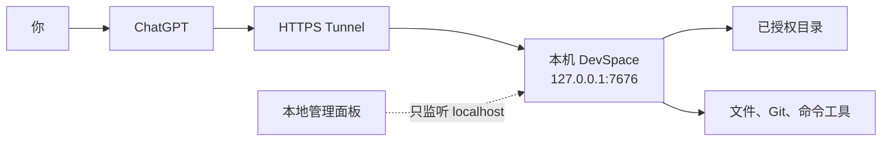

<p align="center">
  <strong>简体中文</strong> · <a href="./README_EN.md">English</a>
</p>

<p align="center">
  
</p>

<h1 align="center">DevSpace</h1>

<p align="center">
  让 ChatGPT 在你授权的本地项目里读代码、改文件、运行测试。
</p>

<p align="center">
  <a href="https://github.com/keepkeen/devspace/blob/main/LICENSE"></a>
  
  
  
</p>

<p align="center">
  <a href="#快速开始">快速开始</a> ·
  <a href="#连接-chatgpt">连接 ChatGPT</a> ·
  <a href="#在对话里怎么用">使用方法</a> ·
  <a href="#权限与安全">权限与安全</a> ·
  <a href="#常见问题">常见问题</a>
</p>

<p align="center">
  <a href="./docs/assets/devspace-screenshot.png">
    
  </a>
</p>

> [!IMPORTANT]
> 这是 [Waishnav/devspace](https://github.com/Waishnav/devspace) 的社区增强分支，
> 基于上游提交
> [`80423b5`](https://github.com/Waishnav/devspace/commit/80423b5)。
> 当前仓库由 [keepkeen/devspace](https://github.com/keepkeen/devspace) 独立维护。

## 它解决什么问题

ChatGPT 运行在云端，不能直接打开你电脑上的
`/Users/alice/code/my-app`。把本地路径发给网页版 Python 或 Code Interpreter
也没有用，因为它们不在你的电脑上。

DevSpace 在本机启动一个 MCP 服务，把你允许访问的目录变成一组工具。连接后，
ChatGPT 可以：

- 读取文件、搜索代码；
- 应用带版本检查的补丁；
- 运行测试、构建、Lint 和 Git 命令；
- 查看当前改动；
- 读取项目里的 `AGENTS.md` 和按需加载的 Skill；
- 在新对话或服务重启后恢复之前的 Workspace。

DevSpace 不会先把整个仓库上传到云端。只有某次工具调用实际返回的内容会发送给
MCP 客户端。

它也不是一个藏在后台的第二个编码模型。正常情况下，ChatGPT 自己调用这些工具，
调用过程会出现在对话里。

## 适合与不适合

DevSpace 适合个人开发机上的代码阅读、修改、测试和审查，尤其适合希望在
ChatGPT 网页端继续处理本地项目的人。

它不适合作为多人共享的远程开发平台，也不提供操作系统级沙箱。需要强隔离时，
请把 DevSpace 放在专用系统账号、容器或虚拟机里运行。

## 它怎么工作



公网地址只用于 MCP 和 OAuth。管理面板运行在另一个本地端口，不应放进 Tunnel。

## 快速开始

### 准备

- Node.js `>=22.19 <27`
- npm 和 Git
- macOS、Linux，或 Windows 上的 WSL/Git Bash
- 一个能访问本机服务的 HTTPS 地址，例如 Cloudflare Tunnel
- 可以创建自定义 MCP App 的 ChatGPT 账号或工作区

完整写入能力取决于 ChatGPT 套餐和工作区设置。OpenAI 当前把完整 MCP 写入能力
作为 Business、Enterprise 和 Edu 的网页版 beta 功能提供；其他套餐可能只能使用
读/取回类操作。界面和权限仍可能变化，请以
[OpenAI 的开发者模式说明](https://help.openai.com/en/articles/12584461-developer-mode-and-mcp-apps-in-chatgpt-beta)
为准。

### 1. 安装

```bash
git clone https://github.com/keepkeen/devspace.git
cd devspace
npm ci
npm run build
```

本文直接使用仓库里的 CLI：

```bash
node dist/cli.js --help
```

也可以执行 `npm link`，之后把 `node dist/cli.js` 换成 `devspace`。

### 2. 初始化

```bash
node dist/cli.js init
```

向导会让你设置：

- 允许访问的根目录，例如 `/Users/alice/code`；
- 本地监听端口，默认 `7676`；
- 公网 HTTPS 地址，不要带 `/mcp`。

配置和 Owner 密码分开保存：

```text
~/.devspace/config.json
~/.devspace/auth.json
```

不要分享或提交 `auth.json`。

### 3. 启动服务

```bash
node dist/cli.js serve
```

在另一个终端检查：

```bash
curl http://127.0.0.1:7676/readyz
```

正常结果是 HTTP `200`：

```json
{"ok":true,"name":"devspace","status":"ready"}
```

安装或原生依赖有问题时，先运行：

```bash
node dist/cli.js doctor
```

### 4. 建立 HTTPS Tunnel

临时测试可以用 Cloudflare Quick Tunnel：

```bash
cloudflared tunnel --url http://127.0.0.1:7676
```

拿到类似下面的地址后：

```text
https://random-name.trycloudflare.com
```

保存它并重启 DevSpace：

```bash
node dist/cli.js config set publicBaseUrl https://random-name.trycloudflare.com
node dist/cli.js serve
```

再检查公网链路：

```bash
curl https://random-name.trycloudflare.com/readyz
```

Quick Tunnel 的地址会变化。长期使用建议配置固定域名的
[Named Tunnel](https://developers.cloudflare.com/cloudflare-one/connections/connect-networks/)。

## 连接 ChatGPT

OpenAI 现在把自定义 MCP 连接称为 App。大致流程如下：

1. 在工作区或个人设置里启用 Developer mode。
2. 打开 **Settings → Apps → Create**，或由管理员从
   **Workspace settings → Apps → Create** 创建。
3. MCP endpoint 填完整地址：

   ```text
   https://devspace.example.com/mcp
   ```

4. 选择 OAuth，点击 **Scan Tools**。
5. 在 DevSpace 授权页输入 `~/.devspace/auth.json` 里的 Owner 密码。
6. 扫描完成后创建 App。
7. 在新对话里从工具菜单选择这个 App，或者在提示中提及它。

如果服务器增加了工具或修改了工具参数，需要在 ChatGPT 的 App 设置里刷新操作。
重启本地服务不会自动更新 ChatGPT 已缓存的工具定义。

## 在对话里怎么用

第一次打开项目时，给出准确路径、别名和任务：

```text
使用 DevSpace。
把 /Users/alice/code/my-app 打开为别名 my-app，并允许修改。
先读取项目指令，再找出失败的测试并修复。
运行最小范围的验证，最后总结改了哪些文件。
```

别名很重要。它是 DevSpace 记住项目的名字，之后不需要反复发送本地路径。

新对话或服务重启后，可以这样说：

```text
使用 DevSpace。
先列出已保存的 Workspace，恢复别名 my-app。
不要重新打开本地路径，也不要创建替代 worktree。
```

DevSpace 会先 `list_workspaces`，再用 alias 或 `workspaceRef` 恢复。旧的网络连接、
receipt 或浏览器会话失效，不代表项目记录丢了。

### Checkout 还是 Worktree

`checkout` 直接指向现有目录。新建 checkout 默认只读；确实要修改当前目录时，
需要明确设置：

```json
{"writeAccess":"read_write"}
```

并行任务或不想碰当前分支时，推荐使用 managed worktree：

```json
{"mode":"worktree","baseRef":"main"}
```

一个长期任务使用一个清楚的 alias，例如 `billing-api-auth-fix`。不要把 ChatGPT 的
“对话分支”当成 Git 分支；需要文件隔离时必须使用真正的 worktree。

### 项目指令

DevSpace 会发现 `AGENTS.md` 等项目指令，但不会在打开项目时把全文一直塞进对话。
它先返回文件清单；准备处理具体路径时，才加载对这些路径生效的指令正文。

根 `AGENTS.md` 最好只写长期稳定的信息：

- 构建和测试命令；
- 目录或模块边界；
- 必须遵守的检查；
- 明确禁止的操作。

较长的设计背景放进 `docs/`，子目录规则放在对应目录的嵌套 `AGENTS.md`。

### 查看改动

只要授权包含 `workspace:read`，`show_changes` 就可以做只读预览。
`DEVSPACE_WIDGETS` 只控制 ChatGPT 是否显示 Widget，不控制这个工具是否存在。

推进 review checkpoint 属于写操作，需要写权限和 `operationId`；普通预览不会改变
checkpoint。

## DevSpace 怎样记住项目

Workspace 状态保存在本地 SQLite 中，不依赖某一条 HTTP 连接。

ChatGPT 调用时，服务会把当前 App 授权、对话 session 和 Workspace 绑定起来，
所以普通文件工具不需要在每次调用里重复传一长串句柄。其他 MCP 客户端也可以
使用服务返回的 receipt 继续同一个 Workspace。

服务重启后，进程内 session binding 和 receipt 会失效，但下面这些内容仍会保留：

- alias 和 `workspaceRef`；
- checkout/worktree 类型；
- 写权限；
- 项目指纹和状态版本；
- 已持久化的操作与进程输出元数据。

恢复时应使用 `list_workspaces → resume_workspace`，而不是凭记忆重新打开路径。

删除并重新创建 ChatGPT App 通常会建立新的本地授权主体，因此默认看不到旧主体的
Workspace。需要恢复时，在本机运行：

```bash
devspace auth principals
devspace auth reconnect-code <principal-id>
```

把一次性代码输入 DevSpace 授权页，不要贴进 ChatGPT 或仓库文件。

## 权限与安全

DevSpace 的 OAuth 权限分成六类：

| Scope | 能做什么 |
| --- | --- |
| `workspace:read` | 打开和读取 Workspace、查看指令与改动。 |
| `workspace:write` | 修改文件和推进 review checkpoint。 |
| `process:execute` | 启动、轮询和操作本地进程。 |
| `network:access` | 让命令继承主机网络。 |
| `worktree:create` | 创建 managed Git worktree。 |
| `workspace:revoke` | 关闭或撤销 Workspace。 |

如果客户端授权时没有请求 scope，DevSpace 只授予 `workspace:read`。工具列表会按
当前授权裁剪，服务端在真正执行前还会再检查一次。

文件修改还有几层保护：

- `read` 返回文件版本；
- `apply_patch` 必须带对应的 `ifMatch`；
- 新文件必须明确声明原先不存在；
- 写操作使用 `operationId`，响应丢失后可以安全查询或重放结果；
- 同一物理项目的写操作会跨 DevSpace 进程串行；
- 后台进程运行期间继续持有项目写租约。

ChatGPT 或 Tunnel 提前断开 HTTP 请求时，DevSpace 会立即释放该请求占用的容量，
但不会假装已经开始的命令或写操作被取消。后台仍会继续跟踪它们的真实结果。

### 需要明确知道的边界

> [!WARNING]
> `exec_command` 以运行 DevSpace 的系统用户身份执行。文件工具的目录允许列表不是
> 任意 shell 命令的操作系统沙箱。

默认运行时：

- 没有进程 sandbox；
- 没有可靠的单进程网络隔离；
- 文件隔离属于应用层 guardrail；
- 外部编辑器不受 DevSpace 文件锁控制。

因此建议：

1. 只授权真正需要的项目目录，不要授权 `~` 或 `/`。
2. 优先在 managed worktree 里做可写任务。
3. 保护好 `auth.json`、Tunnel 凭据和本机账号。
4. 不要把管理面板暴露到公网。
5. 高风险项目使用专用系统账号、容器或虚拟机。

更完整的说明见[安全模型](./docs/security.md)。

## 本地管理面板

```bash
node dist/cli.js admin
```

面板只监听 localhost，可以：

- 管理允许访问的目录；
- 设置用户级指令和 Widget 模式；
- 调整 MCP、进程、输出、命令和 Workspace 配额；
- 查看本地服务、Tunnel、配额和脱敏诊断；
- 撤销全部 OAuth 客户端和 Token；
- 在明确配置的 macOS launchd 服务上执行受控重启。

允许目录的变化会热更新。其他运行参数通常需要重启后端。

要允许面板控制一个用户级 launchd 服务，需要设置固定 label：

```bash
DEVSPACE_LAUNCHD_SERVICE_LABEL=com.waishnav.devspace node dist/cli.js admin
```

面板不会启动或接管 `cloudflared`。

## 长期运行

长期使用需要同时保持两个进程在线：

```text
DevSpace 服务 + HTTPS Tunnel
```

建议用 launchd、systemd 或其他服务管理器托管，并为 Tunnel 使用固定域名。

常用检查：

```bash
curl http://127.0.0.1:7676/readyz
curl https://devspace.example.com/readyz
node dist/cli.js doctor
```

默认使用 stateless MCP HTTP。全局 MCP 并发上限默认 `64`，单连接主体默认
`8`；可以在管理面板、配置文件或环境变量中调整。提高上限只能提供更多并发空间，
不应代替对异常请求的排查。

## 常见问题

### ChatGPT 看不到新工具

服务器工具定义变更后，在 ChatGPT 的 App 设置里刷新操作。只重启 DevSpace 不会
刷新 ChatGPT 的缓存。

### 公网地址返回 502

先分别检查本地和公网：

```bash
curl http://127.0.0.1:7676/readyz
curl https://devspace.example.com/readyz
```

- 本地失败：检查 DevSpace 服务日志。
- 本地正常、公网失败：检查 `cloudflared` 和 ingress。
- 日志出现 `MCP request capacity reached`：查看配额和内部诊断，确认是否有异常长请求。

### `better-sqlite3` 无法加载

安装依赖和运行服务可能使用了不同 Node ABI：

```bash
npm rebuild better-sqlite3
node dist/cli.js doctor
```

### 新 App 看不到旧 Workspace

新的 App 授权默认使用新的本地主体。用 `devspace auth principals` 找到旧主体，再生成
一次性 reconnect code。不要重新打开路径来“碰运气”，否则可能创建重复 Workspace。

更多问题见[故障排查](./docs/gotchas.md)。

## 从 1.x 升级

2.0 使用新的 Workspace context、OAuth grant 和 canonical v15 数据库结构。

升级前：

1. 停止 DevSpace。
2. 复制整个 state directory，默认是 `~/.local/share/devspace`。
3. 升级代码、安装依赖并构建。
4. 启动 2.0，等待数据库迁移完成。
5. 在 ChatGPT 中刷新 App 工具。

不要只备份主 SQLite 文件；进程输出元数据也属于 state directory。需要回滚时，先停掉
2.0，再恢复整个目录。

迁移细节见[配置参考](./docs/configuration.md)。

## 开发

```bash
npm ci
npm run dev
npm run typecheck
npm test
npm run test:browser
npm run build
npm run test:pack
```

`test:pack` 会构建发布包，在全新的临时项目里安装它，运行 CLI、SQLite 和服务烟测，
最后执行生产依赖审计。

## 文档

- [安装指南](./docs/setup.md)
- [ChatGPT 编码工作流](./docs/chatgpt-coding-workflow.md)
- [真实 ChatGPT 宿主验收矩阵](./docs/chatgpt-host-acceptance.md)
- [配置参考](./docs/configuration.md)
- [安全模型](./docs/security.md)
- [故障排查](./docs/gotchas.md)

## 上游与许可证

DevSpace 由 [Waishnav](https://github.com/Waishnav) 创建。本分支保留原项目历史、资源
和 MIT 许可证，并维护面向 ChatGPT 本地编码工作流的增强功能。

- 上游项目：[Waishnav/devspace](https://github.com/Waishnav/devspace)
- 当前分支：[keepkeen/devspace](https://github.com/keepkeen/devspace)
- 对比基线：[`80423b5`](https://github.com/Waishnav/devspace/commit/80423b5)
- 许可证：[MIT](./LICENSE)
