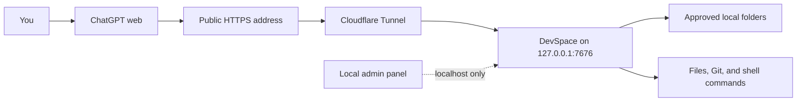

<p align="center">
  <a href="./README.md">简体中文</a> · <strong>English</strong>
</p>

<p align="center">
  
</p>

<h1 align="center">DevSpace</h1>

<p align="center">
  <strong>Let ChatGPT read, edit, and test projects on your computer.</strong>
</p>

<p align="center">
  DevSpace turns approved local folders into secure MCP tools.<br>
  ChatGPT works on the real files; your whole repository is not uploaded to a hosted sandbox.
</p>

<p align="center">
  <a href="https://github.com/keepkeen/devspace/blob/main/LICENSE"></a>
  
  
  
</p>

<p align="center">
  <a href="#quick-start">Quick start</a> ·
  <a href="#connect-chatgpt">Connect ChatGPT</a> ·
  <a href="#how-to-use-it">How to use it</a> ·
  <a href="#recommended-project-organization">Project organization</a> ·
  <a href="#why-this-fork">Fork highlights</a> ·
  <a href="#security">Security</a>
</p>

<p align="center">
  <a href="./docs/assets/devspace-screenshot.png">
    
  </a>
</p>

> [!IMPORTANT]
> This is a community fork of
> [Waishnav/devspace](https://github.com/Waishnav/devspace), based on upstream
> commit [`80423b5`](https://github.com/Waishnav/devspace/commit/80423b5).
> It is not an official upstream release.

## What is DevSpace?

ChatGPT runs in the cloud. It cannot normally open a path such as
`/Users/alice/code/my-app` on your computer. Code Interpreter and hosted Python
also run on a different machine, so giving them a local path does not help.

DevSpace solves this by running a small MCP server on your computer. After you
approve a folder, ChatGPT can call tools to:

- read files and search the project;
- edit files and apply patches;
- run tests, linters, builds, and other shell commands;
- inspect Git changes;
- follow `AGENTS.md`, `CLAUDE.md`, and local Skills;
- continue using the same workspace after a conversation or network session ends.

In the normal workflow, DevSpace is a tool server rather than another coding
agent. ChatGPT decides which DevSpace tools to call, and each call is visible in
the conversation. Optional local subagents exist for advanced use, but they are
disabled by default.

Only folders in your allowlist can be opened by the dedicated file tools. Only
content returned by a tool call is sent to the connected MCP client; DevSpace
does not upload the entire repository in advance.

## How it works



The public address carries MCP and OAuth traffic. The management panel listens
only on localhost and is not exposed through the tunnel.

## Quick start

### Requirements

- Node.js `>=22.19 <27`
- npm and Git
- Bash on macOS/Linux, or Git Bash/WSL on Windows
- a public HTTPS tunnel such as
  [Cloudflare Tunnel](https://developers.cloudflare.com/cloudflare-one/connections/connect-networks/)
- a ChatGPT account or workspace that allows developer mode

Use the same Node.js installation for `npm ci`, `npm run build`, and the running
service. DevSpace uses `better-sqlite3`, which is compiled for a specific Node
ABI.

### 1. Install this fork

```bash
git clone https://github.com/keepkeen/devspace.git
cd devspace
npm ci
npm run build
```

The examples below run the CLI from the cloned repository:

```bash
node dist/cli.js --help
```

If you prefer the shorter `devspace` command:

```bash
npm link
devspace --help
```

### 2. Configure DevSpace

```bash
node dist/cli.js init
```

The setup wizard asks for three things:

1. **Allowed roots** — folders ChatGPT may open, such as
   `/Users/alice/code`.
2. **Local port** — normally `7676`.
3. **Public base URL** — your HTTPS tunnel address, without `/mcp`.

DevSpace stores normal settings and the Owner password separately:

```text
~/.devspace/config.json
~/.devspace/auth.json
```

Keep `auth.json` private. Anyone with its Owner password can approve a new MCP
client.

### 3. Start DevSpace

```bash
node dist/cli.js serve
```

Leave the process running and verify it from another terminal:

```bash
curl http://127.0.0.1:7676/readyz
```

A healthy server returns HTTP `200` and JSON containing:

```json
{"ok":true,"name":"devspace","status":"ready"}
```

You can also run a local installation check:

```bash
node dist/cli.js doctor
```

### 4. Start an HTTPS tunnel

For a quick test:

```bash
cloudflared tunnel --url http://127.0.0.1:7676
```

Cloudflare prints a temporary URL such as:

```text
https://random-name.trycloudflare.com
```

Save it in DevSpace and restart the DevSpace process:

```bash
node dist/cli.js config set publicBaseUrl https://random-name.trycloudflare.com
node dist/cli.js serve
```

Then verify the complete public route:

```bash
curl https://random-name.trycloudflare.com/readyz
```

Quick Tunnel addresses change when the tunnel restarts. For regular use, create
a named Cloudflare Tunnel with a stable hostname:

```bash
cloudflared tunnel login
cloudflared tunnel create devspace
cloudflared tunnel route dns devspace devspace.example.com
```

Example `~/.cloudflared/config.yml`:

```yaml
tunnel: YOUR_TUNNEL_UUID
credentials-file: /Users/you/.cloudflared/YOUR_TUNNEL_UUID.json

ingress:
  - hostname: devspace.example.com
    service: http://127.0.0.1:7676
  - service: http_status:404
```

Start the named tunnel:

```bash
cloudflared tunnel --config ~/.cloudflared/config.yml run devspace
```

Finally, save its public address:

```bash
node dist/cli.js config set publicBaseUrl https://devspace.example.com
```

## Connect ChatGPT

OpenAI currently calls custom MCP integrations **developer-mode apps**. The UI
can change, so the current official guide is
[Connect from ChatGPT](https://developers.openai.com/apps-sdk/deploy/connect-chatgpt).

1. In ChatGPT, open **Settings → Security and login** and enable
   **Developer mode**. Your workspace administrator may need to allow it.
2. Open **Settings → Plugins**, or visit
   [chatgpt.com/plugins](https://chatgpt.com/plugins).
3. Create a new developer-mode app.
4. Give it a clear name and description, for example `Local DevSpace`.
5. Enter the full MCP endpoint:

   ```text
   https://devspace.example.com/mcp
   ```

6. Create the app and review the tools ChatGPT discovers.
7. Complete the DevSpace OAuth page with the Owner password from
   `~/.devspace/auth.json`.
8. Start a new chat, click the **+** button near the composer, choose
   **More**, and add the DevSpace app to the conversation.

When DevSpace adds or changes tools, open the app in **Settings → Plugins** and
choose **Refresh**. Restarting only the local server does not automatically
refresh ChatGPT's cached tool definitions.

## How to use it

For the first connection to a project, provide its exact path and a memorable alias:

```text
Use DevSpace to open /Users/alice/code/my-app as alias my-app.
Read the project instructions, find the failing tests, fix the problem,
run the smallest relevant verification, and summarize the changed files.
```

The expected workflow is:

1. ChatGPT calls `open_workspace` with the path and alias. The default response
   is metadata-only, so instructions and Skills are not injected yet. The
   metadata receipt can only load context or close/revoke the Workspace; it
   cannot read, inspect, execute, or modify local files.
2. It passes that receipt to `get_workspace_context` with
   `contextMode: "full"` to receive the v3 structured instructions, Skill
   catalog, and a refreshed context-loaded receipt. The model-visible
   `workspace` contains `ref`, `alias`, a path-safe `projectFingerprint`, and
   generation; `continuation` contains the receipt, phase, fixed expiry, and
   both revisions. Revision-based suppression
   is allowed only when `get_workspace_context(retained)` refreshes that exact
   current context-loaded receipt. Open, resume, new conversations, and
   compacted contexts must use `full`.
3. ChatGPT passes the current receipt to reads, searches, edits, and commands.
   Every Workspace-scoped result echoes the same visible `workspace` and
   `continuation`. Ordinary tools neither issue a new receipt nor extend its
   deadline; only explicit context load or refresh renews that fixed expiry.
   The receipt binds the local connection principal, Workspace and generation,
   context phase, a private context session, and both context revisions.
4. Each ChatGPT tool call may use a fresh stateless HTTP transport. Continuity
   comes from the persisted Workspace record, so reconnects and stale MCP
   session headers do not interrupt the workspace. The same authorized client
   can reopen and reuse the same workspace in later conversations. A new
   conversation calls
   `list_workspaces`, then `resume_workspace` with exactly one returned alias or
   persistent `workspaceRef`, without resending an absolute host path.
   `list_workspaces` also returns a stable `projectFingerprint` for separating
   same-named projects without exposing host paths.
   A deleted and re-added ChatGPT app receives a new dynamic OAuth registration
   and creates a new connection principal on its first successful approval, so
   it cannot see old aliases. To
   deliberately recover the earlier local identity, run `devspace auth
   principals`, generate `devspace auth reconnect-code <principal-id>`, and
   enter that one-time short-lived code on the new OAuth approval page. Old
   receipts never transfer between registrations.
   One connection principal can retain several project aliases. ChatGPT does
   not provide DevSpace with a trusted conversation ID, so each conversation
   must treat its selected alias as the continuity key: after a later-day turn,
   platform disconnect, or fresh transport, list and resume that alias instead
   of opening a replacement worktree. If a managed worktree path disappears,
   its alias remains `recovery_required`; resume recreates the same Workspace at
   the original path and prefers Git's latest recorded commit. Lost uncommitted
   files cannot be guaranteed and the result reports `dataLossPossible=true`.
5. `close_workspace` is used only when you explicitly ask to release it.
   Unused workspaces may also expire after the configured idle period.

New checkout workspaces default to read-only. Use explicit
`writeAccess: "read_write"` when the current checkout must be modified, or
prefer `mode: "worktree"` for an isolated writable workspace. Existing
persisted checkouts retain write access across the upgrade.

Do not tell ChatGPT to use hosted Python or Code Interpreter to inspect a local
path. Those tools are still fine for unrelated calculations or generated data;
local project work should go through DevSpace.

### A connection principal is not a ChatGPT account identity

DevSpace does not receive a verified ChatGPT account `sub`. Dynamic OAuth
registration alone creates no identity; its first successful Owner approval
creates an isolated local connection principal. This is connection-level
isolation, not proof of account identity. A new registration
joins an older principal only after the owner enters a locally generated,
one-time reconnect code.

Two principals can still open the same physical checkout. Within one DevSpace
instance, normalized-root read/write locks allow concurrent inspection but put
patches, commands, writable process input, explicit review-checkpoint
advancement, close, and revoke through one write queue. The default change
preview shares the read side. The lock covers the MCP call, not the entire lifetime
of a returned background process. Later process effects remain explicitly
`unknown`, and strict `ifMatch` preconditions prevent silent patch overwrites.
Close and revoke stop tracked processes. Prefer separate Git worktrees for
parallel work.

### OAuth capability scopes

DevSpace supports `workspace:read`, `workspace:write`, `process:execute`,
`network:access`, `worktree:create`, and `workspace:revoke`. The approval page
shows these capabilities and every tool checks them again before execution.
The legacy `devspace` scope remains a compatibility alias for all capabilities;
new deployments can restrict the requestable set with `DEVSPACE_OAUTH_SCOPES`.

### `AGENTS.md` and Skills

The initial `open_workspace` call returns metadata by default. After
`get_workspace_context(receipt, full)`, DevSpace returns structured
`instructions.items[]` records with source, scope, relative path, hash, trust,
and content. One user-level file may be explicitly
selected in the Admin panel or with `DEVSPACE_USER_INSTRUCTIONS_PATH`. DevSpace does not
implicitly read `~/.codex/AGENTS.md`; `DEVSPACE_AGENT_DIR` is only a Skill
compatibility root. The root chain returned by full context is acknowledged for
that receipt's private context session, so it is not sent a second time before
the first root-scoped mutation. Reads only advertise
`scopedInstructionsAvailable=true`. Before entering a newly instructed nested
scope for a mutation or command, ChatGPT calls `load_workspace_instructions`
for the intended paths and receives only the additional structured instructions
plus a one-time token. The token can only be consumed by the context session
that requested it. Resuming a new conversation creates independent
acknowledgement state and does not clear an older valid receipt's state.
Whitespace-only files are skipped, the combined user/root/nested
instruction chain is limited to 32 KiB, and interactive `write_stdin` input is
gated when a running process may enter a newly instructed directory. Each
full-context result includes a `sha256-v1:` `instructionRevision` over the
ordered initial path/content pairs so clients can recognize an unchanged chain.
The Skill catalog has an independent `skillRevision`; pass
`knownSkillRevision` only when refreshing the exact current context-loaded
receipt with `get_workspace_context(retained)` while the prior catalog is still
retained. Use `full` after a new conversation or context compaction.

DevSpace also advertises matching local Skills; `list_skills` adds bounded
search and pagination. ChatGPT web has no Codex
`$skill` or `/skills` picker, so the model calls `load_skill` to load one
complete `SKILL.md`. Supporting files remain unavailable until that succeeds.
It can then read references, scripts, and other support files through paths
such as `skill://<skillId>/references/example.md` without receiving the host's
absolute Skill path. Duplicate names are preserved and distinguished by
`skillId`, a privacy-safe logical path, and scope.
Repository Skills are always `repository_untrusted` and `explicitOnly`; a
repository's own `agents/openai.yaml` cannot grant itself implicit invocation.
`load_skill` returns provenance and the manifest body in structured
`skill.content`, while its fixed text only states the trust boundary.
Explicit-only Skills are omitted from the automatic full-context catalog. When
the user explicitly names one, the model calls `list_skills` with that exact
query to obtain its sanitized description and `skillId`, then calls
`load_skill`.
To locally trust one repository Skill, add its exact directory or `SKILL.md`
path to `DEVSPACE_SKILL_PATHS`; that local allowlist takes precedence over
automatic repository discovery without loading the manifest twice.
See the detailed
[ChatGPT coding workflow](./docs/chatgpt-coding-workflow.md).

### Fixed tool contract

DevSpace exposes one stable Codex-style surface: `read`, `batch_read`,
`batch_inspect`, `apply_patch`, `exec_command`, `write_stdin`, and
`read_process_output`, plus `list_workspaces`, `resume_workspace`,
`get_workspace_context`, `load_workspace_instructions`, `get_operation_status`,
`revoke_workspace`, and optional Skill tools. It no longer
switches between `bash`, `exec_command`, or dedicated file-tool names, avoiding
stale ChatGPT tool-schema confusion.

`exec_command` prefers direct `program` plus `args`, preserving argument
boundaries without shell parsing. Use `shell: true` plus `command` only for
shell syntax; legacy `cmd` remains compatible. For multiline Python, SQL, or SSH scripts, the model can use the structured
`stdin` field on `exec_command` instead of fragile nested quoting. Stdin
closes by default after an initial payload; set `closeStdin: false` to continue
through `write_stdin`, which can append data or close the stream. PTY sessions
do not emulate EOF with Ctrl-D.

`apply_patch`, `exec_command`, `close_workspace`, and `revoke_workspace`
require an `operationId`. `show_changes` is a read-only preview by default: it
does not advance the checkpoint and needs neither write scope nor an operation
ID. Only `advanceCheckpoint: true` requires `operationId` and
`workspace:write`. `write_stdin` also requires one when it
sends input, closes stdin, or resizes a terminal; polling alone does not. Use a
fresh ID for a new operation and reuse it only after a lost network response;
DevSpace replays the stored result instead of executing twice. Failures expose
structured `error.code`, `retryable`, `safeToRetry`, `recovery`, `phase`, and
`effectsKnown`. A non-zero command exit returns `ok: false`,
`status: "exited"`, `commandExecuted: true`, and `exitCode`; it is distinct
from a command that never started.
`get_operation_status(operationId)` checks retained state without executing or
repeating the stored result body.

Every Workspace-scoped tool requires the current v3 `receipt`. The unified
registration layer validates the connection principal, OAuth capabilities,
generation, context phase, and private
context-session binding before the handler starts. Metadata receipts can only
promote context or close/revoke the Workspace. Receipt storage has both global
and per-principal limits; use refreshes LRU recency but not the fixed deadline.
Restarts, principal relink/revoke, Owner-credential or root-authority changes,
and close/reopen cycles stale old receipts. Reapproving the same client with
the same principal and authority does not. `read` returns `contentHash` and
exact string `mtimeNs`. By default,
`apply_patch` requires an `ifMatch` entry for every touched path: use the latest
read version for an existing path and explicit `null` for a path expected not
to exist. A patch with any missing path precondition is rejected before it
starts.

Workspace-scoped results use a common `workspace` and `continuation` envelope.
Only context-loading results retain a separate `context.phase`, avoiding a
second copy of both revisions on every ordinary tool result.
Mutations add `operation` with `not_started`, `committed`, or
`outcome_unknown`, plus retry and effect-knowledge semantics. Effects identify
their evidence as `observed`, `declared`, or `unknown` rather than claiming a
precise file list for arbitrary process behavior.

Equivalent managed-worktree opens reuse the same active worktree for one
connection principal and base commit; set `forceNew: true` only for an explicitly separate
isolation. `list_workspaces` returns persisted `dirtySource`, while compact
`project` context reports an empty project, bounded top-level names, and
best-effort Git branch/dirty state. Expiry removes only clean worktrees and
never automatically deletes a dirty one.

When several independent files or searches are already known, `batch_read` and
`batch_inspect` reduce MCP round trips. Optional short input refs are echoed,
and results explicitly report `completed`, `partial`, or `failed` with counts.
DevSpace does not force batching when
the next file depends on the result of the previous search.
Successful `batch_read.items[]` include `path`, `content`, `contentHash`, exact
`mtimeNs`, `offset`, and optional `nextOffset`/`truncated`. Batch and single-file
reads share the same before/after stability check, so these versions can be
used directly as `apply_patch.ifMatch` preconditions.

DevSpace keeps each large model-visible payload in one place so the same file
or command output does not consume context in both `content` and
`structuredContent`. Reads put file text only in `content`; Skill bodies live
in structured `skill.content` with source/trust metadata. Process structures
emit only actionable handles or exceptional state. `batch_read` uses the
versioned file records above, while `batch_inspect` keeps `ref/ok/result`
entries; neither echoes absolute host paths or an aggregate `result`. `_meta` is
optional ChatGPT component data and can be
ignored by ordinary MCP clients. Clients that consumed the old duplicate
fields must follow these result locations; see the
[ChatGPT coding workflow](./docs/chatgpt-coding-workflow.md) for the full contract.
Each loaded `SKILL.md` is capped at 64 KiB.

## Recommended project organization

DevSpace persists work as a **Workspace alias under one connection principal**.
The most predictable layout is one Git project per directory, one continuing
task per alias, and one managed worktree whenever parallel work needs file-level
isolation. Do not use the whole home directory as one project root.

Recommended layout:

```text
~/code/                              # DevSpace allowed root
├── billing-api/                     # one independent Git project
│   ├── AGENTS.md                    # short, stable repository-wide rules
│   ├── docs/
│   │   └── agent-architecture.md    # detailed background outside root context
│   ├── services/
│   │   └── payments/
│   │       └── AGENTS.md            # incremental rules for this subtree
│   ├── .agents/
│   │   └── skills/
│   │       └── release-check/
│   │           ├── SKILL.md         # repository Skill, explicit-only by default
│   │           └── references/
│   └── package.json
└── mobile-app/                      # another project with another alias

~/.agents/skills/                    # trusted personal Skills outside repositories
└── company-review/
    └── SKILL.md
```

Choose a Workspace this way:

| Need | Recommended action |
| --- | --- |
| Continue the same task tomorrow | Call `list_workspaces` and resume the original alias; do not resend the path. |
| Continue the same task in a new chat | Resume the same alias; both conversations observe the same Workspace state. |
| Start an independent task in the same repository | Create a new managed worktree and alias, such as `billing-api-auth-fix`. |
| Review the current checkout | Use the default read-only checkout without write authority. |
| Let two accounts or principals modify the same repository | Give each one a managed worktree; do not share one writable checkout. |
| Work on several projects | Keep a distinct alias for each project and avoid moving one conversation among unrelated aliases. |

Organize the projects themselves with these rules:

1. **Allowlist a project collection, not your home directory.** Prefer
   `~/code` or `~/work`; do not approve `~`, `/`, a cloud-drive root, or a
   directory containing broad private data.
2. **Create a Git baseline commit first.** Managed worktrees require a valid
   commit. Commit important checkpoints: when a physical worktree disappears,
   DevSpace can reconstruct committed content but cannot guarantee recovery of
   uncommitted files lost with the directory.
3. **Keep the root `AGENTS.md` concise.** Put build commands, test requirements,
   architecture boundaries, and prohibitions there. Put detailed design in
   `docs/` and subsystem rules in nested `AGENTS.md` files. The effective chain
   is capped at 32 KiB; shorter instructions preserve model context.
4. **Separate Skills by trust source.** Repository Skills are untrusted and
   explicit-only by default. Put trusted personal or administrator Skills in
   user/Admin roots. Add an exact directory to `DEVSPACE_SKILL_PATHS` only when
   implicit selection is intentional. Keep descriptions on one line and long
   material under `references/`.
5. **Do not store secrets in instructions or Skills.** Tokens, SSH keys, cloud
   credentials, and private environment values belong in the OS keychain or
   process environment and should be passed only to commands that need them.
6. **Keep generated data inside the project.** Put `dist`, `coverage`, caches,
   and temporary test output under the repository and add them to `.gitignore`,
   so normal cleanup never targets paths outside the Workspace.
7. **Open a monorepo at its root by default.** Use nested instructions for
   package differences. Open a subproject separately only when it needs an
   independent authority boundary, lifecycle, or task history.
8. **A conversation branch is not a Git branch.** A ChatGPT branch copies the
   receipt but still points at the same Workspace. Use a managed worktree when
   file-level isolation is required.

## Keep it running

For an always-available ChatGPT connection, both processes must stay alive:

```text
DevSpace server  +  HTTPS tunnel
```

Run both with an OS service manager such as `launchd` or `systemd`, enable
automatic restart, and use a stable tunnel hostname. A ChatGPT conversation may
end without closing the local workspace; DevSpace's workspace state is stored
in SQLite and is not tied to one HTTP connection.

If the server restarts, ChatGPT may open a fresh MCP transport. Existing
checkout workspaces remain available, but old receipts are invalid: call
`list_workspaces`, then `resume_workspace` with an alias or `workspaceRef` and
`contextMode: "full"` for a fresh receipt.

<details>
<summary><strong>Shadowrocket or another TUN proxy</strong></summary>

Put direct Cloudflare Tunnel rules before your generic proxy and final rules:

```text
DOMAIN,region1.v2.argotunnel.com,DIRECT
DOMAIN,region2.v2.argotunnel.com,DIRECT
DOMAIN-SUFFIX,argotunnel.com,DIRECT
IP-CIDR,198.41.192.0/24,DIRECT,no-resolve
IP-CIDR,198.41.200.0/24,DIRECT,no-resolve
IP-CIDR6,2606:4700:a0::/48,DIRECT,no-resolve
IP-CIDR6,2606:4700:a8::/48,DIRECT,no-resolve
```

Do not route the whole `198.18.0.0/15` Fake-IP range directly.

</details>

## Local management panel

```bash
node dist/cli.js admin
```

DevSpace opens a one-time URL on localhost. The panel can:

- add and remove allowed folders, applied live without a restart;
- choose the widget mode and user-level instruction file;
- set MCP, process, workspace, command, and worktree limits;
- show backend, tunnel, quota, and recent failure status;
- download a redacted diagnostic report;
- revoke all OAuth clients and tokens;
- restart an explicitly enrolled macOS `launchd` backend and verify the new PID
  and readiness generation.

Saving settings does not silently restart the backend. Allowed-root changes are
hot-reloaded: additions are available immediately, while removals invalidate
affected workspaces and terminate their running commands. Other runtime changes
take effect after a verified restart. On macOS, backend control
must be explicitly enabled for the admin process, for example:

```bash
DEVSPACE_LAUNCHD_SERVICE_LABEL=com.waishnav.devspace node dist/cli.js admin
```

The panel never starts, adopts, or kills an arbitrary `cloudflared` process.
Tunnel control is intentionally status-only.

## Why this fork?

The upstream project proved that a local workspace could be exposed through
MCP. This fork focuses on making that workflow dependable for daily ChatGPT web
use.

The comparison is against upstream commit
[`80423b5`](https://github.com/Waishnav/devspace/commit/80423b5).

| Area | What this fork adds |
| --- | --- |
| Conversation and project continuity | Workspaces are independent of short-lived MCP transports. Visible aliases, persistent `workspaceRef` values, and HMAC `projectFingerprint` values let several conversations under one connection retain different projects and resume them precisely later. |
| Worktree recovery | A missing managed-worktree directory does not create an endless sequence of replacement branches. The original Workspace ID and alias remain `recovery_required`; recovery prefers the latest Git worktree metadata commit and explicitly reports possible uncommitted-data loss. |
| Stable connection principals | Dynamic OAuth registration receives a connection principal only after successful Owner approval. A one-time reconnect code can deliberately restore an earlier principal after a connector is removed and re-added. Principals cannot reuse one another's Workspace, process, output, or operation IDs. |
| Granular OAuth | `workspace:read`, `workspace:write`, `process:execute`, `network:access`, `worktree:create`, and `workspace:revoke` are enforced independently. Reapproving the same client with unchanged authority no longer advances every Workspace generation. |
| Visible continuation | Every Workspace tool echoes the current `workspace` and `continuation`, including fixed `expiresAt`. Ordinary calls do not issue another receipt; context load/refresh renews it, and mutation replay attaches the current continuation dynamically. |
| Fair receipt cache | Receipt storage has global and per-principal quotas, removes expired entries before eviction, and updates LRU order without sliding the fixed TTL, preventing one connection from crowding out others. |
| Compact model context | Metadata/full/retained phases, lazy instructions, explicit-only repository Skills, one canonical body location, and compact envelopes keep tool context bounded. Full multi-turn, branched-chat, and multi-principal simulations measure model-visible bytes continuously. |
| File consistency | `read` and `batch_read` share before/after version checks and return `contentHash`/`mtimeNs`. `apply_patch` requires a complete `ifMatch` entry for every touched path; there is no blind-write mode. |
| Idempotent mutations | Writes, commands, mutating process input, lifecycle changes, and checkpoint advancement use durable operation IDs. Lost responses replay results without executing twice, while unknown outcomes are never rerun automatically. |
| Simpler change review | `show_changes` is a read-only preview by default, requiring neither write scope nor an operation ID and leaving its checkpoint unchanged. Only explicit `advanceCheckpoint` becomes an idempotent write. |
| Command and process boundaries | Normal builds, tests, Git, package commands, and project-local cleanup remain usable. Writes outside the Workspace, root deletion, protected state, `sudo`, and remote-content pipe-to-shell are blocked. Child processes inherit a minimal environment, and background processes do not hold a lifetime Workspace lock. |
| Process output | Commands have hard runtime limits, termination grace, and resource quotas. Large output is retained under an owned `outputId` and paged; ownership binds both principal and Workspace. |
| Instruction gates | User/root/nested instructions return as structured source/trust/scope/hash/revision records. Root instructions are acknowledged per private context session; new subtree rules load explicitly before mutation. The full effective chain is capped at 32 KiB. |
| Skill trust boundary | Repository Skills are always `repository_untrusted` and explicit-only by default and cannot self-enable implicit invocation. Catalog descriptions strip controls, HTML, and code blocks, while untrusted bodies stay separate from fixed server text. |
| Same-root coordination | A fair lock keyed by canonical physical root permits concurrent reads and serializes MCP write calls. Long-running development servers do not hold a lifetime global lease; strict file versions prevent silent overwrite. |
| Revocation and cleanup | Close/revoke blocks new calls, stops tracked processes, and drains active requests. Durable cleanup resumes after crashes. Clean worktrees may be deleted; dirty ones remain auditable. |
| Management and observability | The localhost panel hot-reloads allowed roots, controls quotas, exports redacted diagnostics, and performs controlled restarts. Logs use `connectionRef`, `oauthClientRef`, and `workspaceActivityRef` without raw tokens or host paths. |
| Release supply chain | Claude and Pi use user-installed CLIs, so dormant providers no longer force Claude/Pi/Google SDK trees into every installation; the core file tools are implemented locally with Node. The MCP SDK ships with its audited dependency tree, and minimatch/brace are fixed to safe releases to avoid the upstream Hono 1.x advisory. `test:pack` performs a default fresh-consumer install, runs CLI/SQLite/server smoke tests, and requires `npm audit --omit=dev` to report zero vulnerabilities. |

## Security

DevSpace gives a remote model controlled access to your computer. Treat an
authorized ChatGPT app like a coding collaborator with the permissions of the
OS user running DevSpace.

DevSpace enforces:

- a narrow allowlist for dedicated file tools;
- canonical-path and symlink checks;
- OAuth approval and connection-principal ownership;
- Host and redirect allowlists;
- bounded sessions, processes, output, and command runtime;
- a localhost-only admin panel;
- explicit write annotations and ChatGPT confirmations.

> [!WARNING]
> `exec_command` runs with the permissions of the DevSpace OS user.
> The file-tool allowlist is not an operating-system sandbox for arbitrary shell
> commands. For hard isolation, run DevSpace under a dedicated OS account or in
> a container/VM with only approved folders mounted.

Recommended setup:

1. Approve the narrowest possible folders.
2. Keep `~/.devspace/auth.json` and tunnel credentials private.
3. Never expose the admin panel to the public tunnel.
4. Use TLS and a stable hostname.
5. Review write confirmations and Git diffs.
6. Use a dedicated OS account for higher-risk or multi-user environments.

Read the full [security model](./docs/security.md).

## Configuration

Common commands:

```bash
node dist/cli.js init
node dist/cli.js doctor
node dist/cli.js config get
node dist/cli.js config set publicBaseUrl https://devspace.example.com
node dist/cli.js admin
```

Common environment variables:

| Variable | Default | Purpose |
| --- | --- | --- |
| `HOST` | `127.0.0.1` | Local bind address. |
| `PORT` | `7676` | Local MCP server port. |
| `DEVSPACE_ALLOWED_ROOTS` | — | Comma-separated approved folders. |
| `DEVSPACE_PUBLIC_BASE_URL` | — | Public HTTPS origin without `/mcp`. |
| `DEVSPACE_WIDGETS` | `full` | `full`, `changes`, or `off`. |
| `DEVSPACE_MAX_MCP_SESSIONS` | `64` | Global live MCP session limit. |
| `DEVSPACE_MAX_PROCESS_SESSIONS` | `32` | Global retained process limit. |
| `DEVSPACE_MAX_PROCESS_OUTPUT_FILE_BYTES` | `67108864` | Durable complete-output limit per process (64 MiB). |
| `DEVSPACE_MAX_PROCESS_OUTPUT_STORAGE_BYTES` | `1073741824` | Total durable process-output storage limit (1 GiB). |
| `DEVSPACE_COMPLETED_PROCESS_OUTPUT_TTL_SECONDS` | `86400` | Retention for completed process output (24 hours). |
| `DEVSPACE_MAX_COMMAND_RUNTIME_SECONDS` | `3600` | Hard command runtime limit. |

See the full [configuration reference](./docs/configuration.md).

## Troubleshooting

<details>
<summary><strong>ChatGPT says the local tool is disabled</strong></summary>

- Make sure the DevSpace app is added to the current conversation.
- Check that the configured URL ends in `/mcp`.
- Run `curl https://your-host/readyz`.
- Refresh the app from ChatGPT's plugin settings after tool changes.
- Reauthorize OAuth if the client or token was revoked.

</details>

<details>
<summary><strong>The public URL returns 502</strong></summary>

Check the local server first:

```bash
curl http://127.0.0.1:7676/readyz
```

If local readiness works, inspect `cloudflared` and confirm its ingress target
is `http://127.0.0.1:7676`.

</details>

<details>
<summary><strong><code>better-sqlite3</code> cannot load</strong></summary>

The install and the service probably use different Node.js ABIs:

```bash
npm rebuild better-sqlite3
node dist/cli.js doctor
```

</details>

<details>
<summary><strong>Tool calls are slow</strong></summary>

- Use `batch_read` or `batch_inspect` after several independent targets are known.
- Compare local and public `/readyz` latency.
- Route Cloudflare Tunnel endpoints outside VPN/TUN proxies when appropriate.
- Remember that a long test or build is command time, not MCP transport time.

</details>

More cases are documented in [Troubleshooting Gotchas](./docs/gotchas.md).

## Development

```bash
npm ci
npm run dev
npm run typecheck
npm test
npm run test:browser
npm run build
npm run test:pack
```

`test:pack` does more than create a tarball: it installs the package in a fresh
temporary consumer project, exercises the CLI, native SQLite, and server
startup, then runs a production dependency audit. Any consumer-visible
vulnerability fails the release gate.

## Documentation

- [Setup guide](./docs/setup.md)
- [ChatGPT coding workflow](./docs/chatgpt-coding-workflow.md)
- [Real ChatGPT host acceptance matrix](./docs/chatgpt-host-acceptance.md)
- [Configuration reference](./docs/configuration.md)
- [Security model](./docs/security.md)
- [Troubleshooting](./docs/gotchas.md)

## Upstream and attribution

DevSpace was created by [Waishnav](https://github.com/Waishnav). This fork keeps
the original history, assets, and MIT license while maintaining a separate set
of changes for persistent ChatGPT workflows, security, latency, and local
administration.

- Upstream: [Waishnav/devspace](https://github.com/Waishnav/devspace)
- This fork: [keepkeen/devspace](https://github.com/keepkeen/devspace)
- Baseline: [`80423b5`](https://github.com/Waishnav/devspace/commit/80423b5)

## License

[MIT](./LICENSE) © Waishnav and contributors. Fork changes use the same license.
