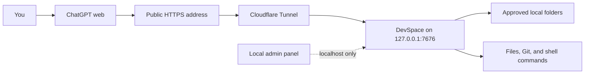

<p align="center">
  <a href="./README.md">简体中文</a> · <strong>English</strong>
</p>

<p align="center">
  
</p>

<h1 align="center">DevSpace</h1>

<p align="center">
  <strong>Let ChatGPT read, edit, and test projects on your computer.</strong>
</p>

<p align="center">
  DevSpace turns approved local folders into secure MCP tools.<br>
  ChatGPT works on the real files; your whole repository is not uploaded to a hosted sandbox.
</p>

<p align="center">
  <a href="https://github.com/keepkeen/devspace/blob/main/LICENSE"></a>
  
  
  
</p>

<p align="center">
  <a href="#quick-start">Quick start</a> ·
  <a href="#connect-chatgpt">Connect ChatGPT</a> ·
  <a href="#how-to-use-it">How to use it</a> ·
  <a href="#recommended-project-organization">Project organization</a> ·
  <a href="#why-this-fork">Fork highlights</a> ·
  <a href="#security">Security</a>
</p>

<p align="center">
  <a href="./docs/assets/devspace-screenshot.png">
    
  </a>
</p>

> [!IMPORTANT]
> This is a community fork of
> [Waishnav/devspace](https://github.com/Waishnav/devspace), based on upstream
> commit [`80423b5`](https://github.com/Waishnav/devspace/commit/80423b5).
> It is not an official upstream release.

## What is DevSpace?

ChatGPT runs in the cloud. It cannot normally open a path such as
`/Users/alice/code/my-app` on your computer. Code Interpreter and hosted Python
also run on a different machine, so giving them a local path does not help.

DevSpace solves this by running a small MCP server on your computer. After you
approve a folder, ChatGPT can call tools to:

- read files and search the project;
- edit files and apply patches;
- run tests, linters, builds, and other shell commands;
- inspect Git changes;
- follow `AGENTS.md`, `CLAUDE.md`, and local Skills;
- continue using the same workspace after a conversation or network session ends.

In the normal workflow, DevSpace is a tool server rather than another coding
agent. ChatGPT decides which DevSpace tools to call, and each call is visible in
the conversation. Optional local subagents exist for advanced use, but they are
disabled by default.

Only folders in your allowlist can be opened by the dedicated file tools. Only
content returned by a tool call is sent to the connected MCP client; DevSpace
does not upload the entire repository in advance.

## How it works



The public address carries MCP and OAuth traffic. The management panel listens
only on localhost and is not exposed through the tunnel.

## Quick start

### Requirements

- Node.js `>=22.19 <27`
- npm and Git
- Bash on macOS/Linux, or Git Bash/WSL on Windows
- a public HTTPS tunnel such as
  [Cloudflare Tunnel](https://developers.cloudflare.com/cloudflare-one/connections/connect-networks/)
- a ChatGPT account or workspace that allows developer mode

Use the same Node.js installation for `npm ci`, `npm run build`, and the running
service. DevSpace uses `better-sqlite3`, which is compiled for a specific Node
ABI.

### 1. Install this fork

```bash
git clone https://github.com/keepkeen/devspace.git
cd devspace
npm ci
npm run build
```

The examples below run the CLI from the cloned repository:

```bash
node dist/cli.js --help
```

If you prefer the shorter `devspace` command:

```bash
npm link
devspace --help
```

### 2. Configure DevSpace

```bash
node dist/cli.js init
```

The setup wizard asks for three things:

1. **Allowed roots** — folders ChatGPT may open, such as
   `/Users/alice/code`.
2. **Local port** — normally `7676`.
3. **Public base URL** — your HTTPS tunnel address, without `/mcp`.

DevSpace stores normal settings and the Owner password separately:

```text
~/.devspace/config.json
~/.devspace/auth.json
```

Keep `auth.json` private. Anyone with its Owner password can approve a new MCP
client.

### 3. Start DevSpace

```bash
node dist/cli.js serve
```

Leave the process running and verify it from another terminal:

```bash
curl http://127.0.0.1:7676/readyz
```

A healthy server returns HTTP `200` and JSON containing:

```json
{"ok":true,"name":"devspace","status":"ready"}
```

You can also run a local installation check:

```bash
node dist/cli.js doctor
```

### 4. Start an HTTPS tunnel

For a quick test:

```bash
cloudflared tunnel --url http://127.0.0.1:7676
```

Cloudflare prints a temporary URL such as:

```text
https://random-name.trycloudflare.com
```

Save it in DevSpace and restart the DevSpace process:

```bash
node dist/cli.js config set publicBaseUrl https://random-name.trycloudflare.com
node dist/cli.js serve
```

Then verify the complete public route:

```bash
curl https://random-name.trycloudflare.com/readyz
```

Quick Tunnel addresses change when the tunnel restarts. For regular use, create
a named Cloudflare Tunnel with a stable hostname:

```bash
cloudflared tunnel login
cloudflared tunnel create devspace
cloudflared tunnel route dns devspace devspace.example.com
```

Example `~/.cloudflared/config.yml`:

```yaml
tunnel: YOUR_TUNNEL_UUID
credentials-file: /Users/you/.cloudflared/YOUR_TUNNEL_UUID.json

ingress:
  - hostname: devspace.example.com
    service: http://127.0.0.1:7676
  - service: http_status:404
```

Start the named tunnel:

```bash
cloudflared tunnel --config ~/.cloudflared/config.yml run devspace
```

Finally, save its public address:

```bash
node dist/cli.js config set publicBaseUrl https://devspace.example.com
```

## Connect ChatGPT

OpenAI currently calls custom MCP integrations **developer-mode apps**. The UI
can change, so the current official guide is
[Connect from ChatGPT](https://developers.openai.com/apps-sdk/deploy/connect-chatgpt).

1. In ChatGPT, open **Settings → Security and login** and enable
   **Developer mode**. Your workspace administrator may need to allow it.
2. Open **Settings → Plugins**, or visit
   [chatgpt.com/plugins](https://chatgpt.com/plugins).
3. Create a new developer-mode app.
4. Give it a clear name and description, for example `Local DevSpace`.
5. Enter the full MCP endpoint:

   ```text
   https://devspace.example.com/mcp
   ```

6. Create the app and review the tools ChatGPT discovers.
7. Complete the DevSpace OAuth page with the Owner password from
   `~/.devspace/auth.json`.
8. Start a new chat, click the **+** button near the composer, choose
   **More**, and add the DevSpace app to the conversation.

When DevSpace adds or changes tools, open the app in **Settings → Plugins** and
choose **Refresh**. Restarting only the local server does not automatically
refresh ChatGPT's cached tool definitions.

## How to use it

For the first connection to a project, provide its exact path and a memorable alias:

```text
Use DevSpace to open /Users/alice/code/my-app as alias my-app.
Read the project instructions, find the failing tests, fix the problem,
run the smallest relevant verification, and summarize the changed files.
```

The expected workflow is:

1. ChatGPT calls `open_workspace` with a user-approved path and alias. The
   default state is `selected`. When the user has explicitly identified the
   project and the task needs repository context, the first call may use
   `contextMode: "full"`.
2. A selected Workspace is promoted with
   `get_workspace_context(contextMode: "full")`. Workspace context v5 returns
   an `instructionManifest` and Skill catalog, not repository instruction
   bodies, and advances to `context_loaded`. Use retained mode only when
   refreshing the exact context whose revisions are still available.
3. Before work on concrete paths, call `load_workspace_instructions(paths)`.
   It returns only the applicable instruction chain and, when required, a
   one-use `instructionToken`; the state advances to `target_scoped`.
4. ChatGPT-style hosts bind the Workspace server-side to
   `(principal, HMAC(openai/session))`, so ordinary tools do not require the
   model to repeat a receipt. Generic MCP clients without `openai/session` pass
   the current `wctx5` receipt. An explicitly invalid receipt never falls back
   to host state. Ordinary results return a compact envelope and no continuation;
   lifecycle, revision, generation, or phase changes return continuation data.
5. In a new conversation, after context loss, or after a server restart, call
   `list_workspaces` and then `resume_workspace` with exactly one alias or
   `workspaceRef`. Open a user-approved path again only when no retained
   Workspace exists. Structured recovery distinguishes `list_then_resume` from
   `open_workspace_full`. Close a Workspace only on explicit user request.

Deleting and re-adding the app creates a new authorization grant and local
principal on approval. Recover an earlier principal only with a locally generated
one-time reconnect code. Server restart invalidates in-process receipts and host
session bindings, while persisted aliases and Workspace records remain resumable.
A missing managed worktree remains `recovery_required`; unrecoverable uncommitted
content is reported with `dataLossPossible=true`.

New checkout workspaces default to read-only. Use explicit
`writeAccess: "read_write"` when the current checkout must be modified, or
prefer `mode: "worktree"` for an isolated writable workspace. Existing
persisted checkouts retain write access across the upgrade.

Do not tell ChatGPT to use hosted Python or Code Interpreter to inspect a local
path. Those tools are still fine for unrelated calculations or generated data;
local project work should go through DevSpace.

### A connection principal is not a ChatGPT account identity

DevSpace does not receive a verified ChatGPT account `sub`. OAuth `client_id`
identifies only a dynamic registration. Authority belongs to an authorization
grant that fixes the principal, granted capabilities, and authorization epoch;
access and refresh tokens reference that grant directly, and refresh never looks
up a principal through `clientId`.

Tool calls may carry `openai/subject`, `openai/organization`, and
`openai/session`. DevSpace stores only purpose-separated HMAC values for grant
consistency, anonymous audit/rate-limit dimensions, and host-session binding.
They are hints and consistency checks, not credentials and not replacements for
the OAuth token. A new registration joins an older principal only through a
one-time reconnect code.

Different principals can still open the same checkout. A canonical-root lock is
shared across DevSpace processes: reads may overlap, while patches, commands,
writable process interaction, checkpoint advancement, close, and revoke are
serialized. A returned background process keeps the write lease until its whole
process tree exits. External editors remain outside this lock, so strict
`ifMatch` checks are still mandatory.

### OAuth capability scopes

DevSpace supports `workspace:read`, `workspace:write`, `process:execute`,
`network:access`, `worktree:create`, and `workspace:revoke`. Omitting
`scope` grants only `workspace:read`; elevated capabilities must be requested
explicitly. tools/list is filtered by the current grant, and handlers repeat the
checks so a cached schema cannot bypass authorization. The ambiguous `devspace`
full-access scope is not accepted.

### `AGENTS.md` and Skills

Full Workspace context is manifest-first. `instructionManifest.files[]` contains
source, trust, scope, relative path, hash, and UTF-8 byte length, but no repository
instruction body. `load_workspace_instructions(paths)` returns the applicable
chain only when concrete paths are about to be handled, together with a reviewed
revision and one-use token when needed. `loadedForScope` means that the server
returned that revision; it does not claim that a model agreed to obey it.
Repository instructions remain `repository_untrusted`.

A user instruction file must be configured explicitly; DevSpace does not read
`~/.codex/AGENTS.md` by default. Instruction chains have a 32 KiB budget, and
reads advertise new scoped guidance without mixing it into file output. Mutations,
commands, and directory-changing interactive input share the same instruction
gate.

Skills have a separate revision. `list_skills` provides bounded search and
pagination, while `load_skill` explicitly loads one manifest by `skillId`.
Supporting files use `skill://` paths. Repository Skills are always
`repository_untrusted` and explicit-only unless trusted through local
administration. See the detailed
[ChatGPT coding workflow](./docs/chatgpt-coding-workflow.md).

### Fixed tool contract

DevSpace exposes a stable tool surface filtered by OAuth capability. The default
read-only profile keeps tools/list below 12 KB; writing, process, network,
worktree, and revocation tools appear only for matching grants. Lifecycle tools
share a versioned envelope with `schemaVersion: 1`, `ok`, Workspace state,
`contextChanged`, and structured errors. Workspace context uses
`contextSchemaVersion: 5`.

ChatGPT hosts normally use server-side session binding; generic clients pass a
`wctx5` receipt. Workspace IDs and generations are identifiers, not authority
handles. Ordinary results contain `workspaceAlias` and
`contextChanged: false`, with continuation data returned only when context,
revision, generation, or phase changes. Receipts are in-process, fixed-expiry
compatibility handles rather than a model-visible field repeated on every call.

Prefer `program` plus `args` for direct execution and use `shell: true` plus
`command` only for shell syntax. `runtimeCapabilities` reports that the
default runtime has no per-process network isolation or process sandbox and only
guardrail-level filesystem confinement, so unsupported `network: "deny"` is not
advertised. The approval page states these risks.

Mutations use unique `operationId` values. Reads return exact file versions, and
`apply_patch` requires `ifMatch` for every touched path, using `null` for a
new file. Errors expose code, phase, retry safety, known-effects state, and
machine-readable recovery. Batch inspection supports bounded grep/glob/list
options and fairly allocates the aggregate output budget; omitted items say
`aggregate_budget_exhausted`, while reads retain `nextOffset`.

## Recommended project organization

DevSpace persists work as a **Workspace alias under one connection principal**.
The most predictable layout is one Git project per directory, one continuing
task per alias, and one managed worktree whenever parallel work needs file-level
isolation. Do not use the whole home directory as one project root.

Recommended layout:

```text
~/code/                              # DevSpace allowed root
├── billing-api/                     # one independent Git project
│   ├── AGENTS.md                    # short, stable repository-wide rules
│   ├── docs/
│   │   └── agent-architecture.md    # detailed background outside root context
│   ├── services/
│   │   └── payments/
│   │       └── AGENTS.md            # incremental rules for this subtree
│   ├── .agents/
│   │   └── skills/
│   │       └── release-check/
│   │           ├── SKILL.md         # repository Skill, explicit-only by default
│   │           └── references/
│   └── package.json
└── mobile-app/                      # another project with another alias

~/.agents/skills/                    # trusted personal Skills outside repositories
└── company-review/
    └── SKILL.md
```

Choose a Workspace this way:

| Need | Recommended action |
| --- | --- |
| Continue the same task tomorrow | Call `list_workspaces` and resume the original alias; do not resend the path. |
| Continue the same task in a new chat | Resume the same alias; both conversations observe the same Workspace state. |
| Start an independent task in the same repository | Create a new managed worktree and alias, such as `billing-api-auth-fix`. |
| Review the current checkout | Use the default read-only checkout without write authority. |
| Let two accounts or principals modify the same repository | Give each one a managed worktree; do not share one writable checkout. |
| Work on several projects | Keep a distinct alias for each project and avoid moving one conversation among unrelated aliases. |

Organize the projects themselves with these rules:

1. **Allowlist a project collection, not your home directory.** Prefer
   `~/code` or `~/work`; do not approve `~`, `/`, a cloud-drive root, or a
   directory containing broad private data.
2. **Create a Git baseline commit first.** Managed worktrees require a valid
   commit. Commit important checkpoints: when a physical worktree disappears,
   DevSpace can reconstruct committed content but cannot guarantee recovery of
   uncommitted files lost with the directory.
3. **Keep the root `AGENTS.md` concise.** Put build commands, test requirements,
   architecture boundaries, and prohibitions there. Put detailed design in
   `docs/` and subsystem rules in nested `AGENTS.md` files. The effective chain
   is capped at 32 KiB; shorter instructions preserve model context.
4. **Separate Skills by trust source.** Repository Skills are untrusted and
   explicit-only by default. Put trusted personal or administrator Skills in
   user/Admin roots. Add an exact directory to `DEVSPACE_SKILL_PATHS` only when
   implicit selection is intentional. Keep descriptions on one line and long
   material under `references/`.
5. **Do not store secrets in instructions or Skills.** Tokens, SSH keys, cloud
   credentials, and private environment values belong in the OS keychain or
   process environment and should be passed only to commands that need them.
6. **Keep generated data inside the project.** Put `dist`, `coverage`, caches,
   and temporary test output under the repository and add them to `.gitignore`,
   so normal cleanup never targets paths outside the Workspace.
7. **Open a monorepo at its root by default.** Use nested instructions for
   package differences. Open a subproject separately only when it needs an
   independent authority boundary, lifecycle, or task history.
8. **A conversation branch is not a Git branch.** A ChatGPT branch copies the
   receipt but still points at the same Workspace. Use a managed worktree when
   file-level isolation is required.

## Keep it running

For an always-available ChatGPT connection, both processes must stay alive:

```text
DevSpace server  +  HTTPS tunnel
```

Run both with an OS service manager such as `launchd` or `systemd`, enable
automatic restart, and use a stable tunnel hostname. A ChatGPT conversation may
end without closing the local workspace; DevSpace's workspace state is stored
in SQLite and is not tied to one HTTP connection.

If the server restarts, ChatGPT may open a fresh MCP transport. Existing
checkout workspaces remain available, but old receipts are invalid: call
`list_workspaces`, then `resume_workspace` with an alias or `workspaceRef` and
`contextMode: "full"` for a fresh receipt.

<details>
<summary><strong>Shadowrocket or another TUN proxy</strong></summary>

Put direct Cloudflare Tunnel rules before your generic proxy and final rules:

```text
DOMAIN,region1.v2.argotunnel.com,DIRECT
DOMAIN,region2.v2.argotunnel.com,DIRECT
DOMAIN-SUFFIX,argotunnel.com,DIRECT
IP-CIDR,198.41.192.0/24,DIRECT,no-resolve
IP-CIDR,198.41.200.0/24,DIRECT,no-resolve
IP-CIDR6,2606:4700:a0::/48,DIRECT,no-resolve
IP-CIDR6,2606:4700:a8::/48,DIRECT,no-resolve
```

Do not route the whole `198.18.0.0/15` Fake-IP range directly.

</details>

## Local management panel

```bash
node dist/cli.js admin
```

DevSpace opens a one-time URL on localhost. The panel can:

- add and remove allowed folders, applied live without a restart;
- choose the widget mode and user-level instruction file;
- set MCP, process, workspace, command, and worktree limits;
- show backend, tunnel, quota, and recent failure status;
- download a redacted diagnostic report;
- revoke all OAuth clients and tokens;
- restart an explicitly enrolled macOS `launchd` backend and verify the new PID
  and readiness generation.

Saving settings does not silently restart the backend. Allowed-root changes are
hot-reloaded: additions are available immediately, while removals invalidate
affected workspaces and terminate their running commands. Other runtime changes
take effect after a verified restart. On macOS, backend control
must be explicitly enabled for the admin process, for example:

```bash
DEVSPACE_LAUNCHD_SERVICE_LABEL=com.waishnav.devspace node dist/cli.js admin
```

The panel never starts, adopts, or kills an arbitrary `cloudflared` process.
Tunnel control is intentionally status-only.

## Why this fork?

The upstream project proved that a local workspace could be exposed through
MCP. This fork focuses on making that workflow dependable for daily ChatGPT web
use.

The comparison is against upstream commit
[`80423b5`](https://github.com/Waishnav/devspace/commit/80423b5).

| Area | What this fork adds |
| --- | --- |
| Conversation and project continuity | Workspaces are independent of short-lived MCP transports. Visible aliases, persistent `workspaceRef` values, and HMAC `projectFingerprint` values let several conversations under one connection retain different projects and resume them precisely later. |
| Worktree recovery | A missing managed-worktree directory does not create an endless sequence of replacement branches. The original Workspace ID and alias remain `recovery_required`; recovery prefers the latest Git worktree metadata commit and explicitly reports possible uncommitted-data loss. |
| Stable grant ownership | Principals belong to OAuth authorization grants rather than client registrations. Codes and tokens retain grant/principal/epoch ownership, while a one-time reconnect code deliberately joins a fresh grant to an earlier principal. |
| Granular OAuth | Missing scope grants only `workspace:read`; six capabilities are enforced independently and filter tools/list. Anonymous subject/organization HMAC values are consistency and audit dimensions, never substitutes for the bearer token. |
| Host session binding | ChatGPT-style hosts bind Workspace context server-side through HMAC `openai/session`, so ordinary calls do not repeat receipts. Generic MCP clients use v5 receipts, and an explicit invalid receipt never falls back. |
| Fair receipt cache | Receipt storage has global and per-principal quotas, removes expired entries before eviction, and updates LRU order without sliding the fixed TTL, preventing one connection from crowding out others. |
| Compact model context | `selected/context_loaded/target_scoped`, manifest-first instructions, explicit-only repository Skills, capability-filtered tools, and compact ordinary envelopes keep context bounded. The default read-only tools/list stays below 12 KB. |
| File consistency | `read` and `batch_read` share before/after version checks and return `contentHash`/`mtimeNs`. `apply_patch` requires a complete `ifMatch` entry for every touched path; there is no blind-write mode. |
| Idempotent mutations | Writes, commands, mutating process input, lifecycle changes, and checkpoint advancement use durable operation IDs. Lost responses replay results without executing twice, while unknown outcomes are never rerun automatically. |
| Simpler change review | `show_changes` is always listed when `workspace:read` is granted; widget mode controls UI only. Its default preview requires neither write scope nor an operation ID and leaves the checkpoint unchanged. Only explicit `advanceCheckpoint` becomes an idempotent write. |
| Command and process boundaries | Normal builds, tests, Git, package commands, and project-local cleanup remain usable. Writes outside the Workspace, root deletion, protected state, `sudo`, and remote-content pipe-to-shell are blocked. A returned background process retains the same-root write lease until its complete process tree exits. |
| Process output | Command text is model-visible in structured `output.text`, retained page text is in `page.text`, and an `outputId` is returned whenever durable output exists. Commands also have hard runtime limits, termination grace, and resource quotas; ownership binds both principal and Workspace. |
| Instruction gates | Full context returns only an instruction manifest. `load_workspace_instructions(paths)` returns the applicable bodies, reviewed revision, and one-use token for concrete targets. Repository guidance remains untrusted and the effective chain is capped at 32 KiB. |
| Skill trust boundary | Repository Skills are always `repository_untrusted` and explicit-only by default and cannot self-enable implicit invocation. Catalog descriptions strip controls, HTML, and code blocks, while untrusted bodies stay separate from fixed server text. |
| Same-root coordination | A cross-process lock keyed by canonical physical root permits concurrent reads and serializes writes. Live background processes keep their lease; external editors remain protected by strict `ifMatch` versions. |
| Revocation and cleanup | Close/revoke blocks new calls, stops tracked processes, and drains active requests. Durable cleanup resumes after crashes. Clean worktrees may be deleted; dirty ones remain auditable. |
| Management and observability | The localhost panel hot-reloads allowed roots, controls quotas, exports redacted diagnostics, and performs controlled restarts. Logs use `connectionRef`, `oauthClientRef`, and `workspaceActivityRef` without raw tokens or host paths. |
| Release supply chain | Claude and Pi use user-installed CLIs, so dormant providers no longer force Claude/Pi/Google SDK trees into every installation; the core file tools are implemented locally with Node. The MCP SDK ships with its audited dependency tree, and minimatch/brace are fixed to safe releases to avoid the upstream Hono 1.x advisory. `test:pack` performs a default fresh-consumer install, runs CLI/SQLite/server smoke tests, and requires `npm audit --omit=dev` to report zero vulnerabilities. |

## Security

DevSpace gives a remote model controlled access to your computer. Treat an
authorized ChatGPT app like a coding collaborator with the permissions of the
OS user running DevSpace.

DevSpace enforces:

- a narrow allowlist for dedicated file tools;
- canonical-path and symlink checks;
- OAuth approval and connection-principal ownership;
- Host and redirect allowlists;
- bounded sessions, processes, output, and command runtime;
- a localhost-only admin panel;
- explicit write annotations and ChatGPT confirmations.

> [!WARNING]
> `exec_command` runs with the permissions of the DevSpace OS user.
> The file-tool allowlist is not an operating-system sandbox for arbitrary shell
> commands. For hard isolation, run DevSpace under a dedicated OS account or in
> a container/VM with only approved folders mounted.

Recommended setup:

1. Approve the narrowest possible folders.
2. Keep `~/.devspace/auth.json` and tunnel credentials private.
3. Never expose the admin panel to the public tunnel.
4. Use TLS and a stable hostname.
5. Review write confirmations and Git diffs.
6. Use a dedicated OS account for higher-risk or multi-user environments.

Read the full [security model](./docs/security.md).

## Configuration

Common commands:

```bash
node dist/cli.js init
node dist/cli.js doctor
node dist/cli.js config get
node dist/cli.js config set publicBaseUrl https://devspace.example.com
node dist/cli.js admin
```

Common environment variables:

| Variable | Default | Purpose |
| --- | --- | --- |
| `HOST` | `127.0.0.1` | Local bind address. |
| `PORT` | `7676` | Local MCP server port. |
| `DEVSPACE_ALLOWED_ROOTS` | — | Comma-separated approved folders. |
| `DEVSPACE_PUBLIC_BASE_URL` | — | Public HTTPS origin without `/mcp`. |
| `DEVSPACE_WIDGETS` | `full` | `full`, `changes`, or `off`. |
| `DEVSPACE_MAX_MCP_SESSIONS` | `64` | Global live MCP session limit. |
| `DEVSPACE_MAX_PROCESS_SESSIONS` | `32` | Global retained process limit. |
| `DEVSPACE_MAX_PROCESS_OUTPUT_FILE_BYTES` | `67108864` | Durable complete-output limit per process (64 MiB). |
| `DEVSPACE_MAX_PROCESS_OUTPUT_STORAGE_BYTES` | `1073741824` | Total durable process-output storage limit (1 GiB). |
| `DEVSPACE_COMPLETED_PROCESS_OUTPUT_TTL_SECONDS` | `86400` | Retention for completed process output (24 hours). |
| `DEVSPACE_MAX_COMMAND_RUNTIME_SECONDS` | `3600` | Hard command runtime limit. |

See the full [configuration reference](./docs/configuration.md).

## Troubleshooting

<details>
<summary><strong>ChatGPT says the local tool is disabled</strong></summary>

- Make sure the DevSpace app is added to the current conversation.
- Check that the configured URL ends in `/mcp`.
- Run `curl https://your-host/readyz`.
- Refresh the app from ChatGPT's plugin settings after tool changes.
- Reauthorize OAuth if the client or token was revoked.

</details>

<details>
<summary><strong>The public URL returns 502</strong></summary>

Check the local server first:

```bash
curl http://127.0.0.1:7676/readyz
```

If local readiness works, inspect `cloudflared` and confirm its ingress target
is `http://127.0.0.1:7676`.

</details>

<details>
<summary><strong><code>better-sqlite3</code> cannot load</strong></summary>

The install and the service probably use different Node.js ABIs:

```bash
npm rebuild better-sqlite3
node dist/cli.js doctor
```

</details>

<details>
<summary><strong>Tool calls are slow</strong></summary>

- Use `batch_read` or `batch_inspect` after several independent targets are known.
- Compare local and public `/readyz` latency.
- Route Cloudflare Tunnel endpoints outside VPN/TUN proxies when appropriate.
- Remember that a long test or build is command time, not MCP transport time.

</details>

More cases are documented in [Troubleshooting Gotchas](./docs/gotchas.md).

## Upgrade from 1.x to 2.0

Version 2.0 is an explicit protocol and database cutover. Stop DevSpace through
your OS service manager, then copy the entire state directory (default
`~/.local/share/devspace`) as an offline backup. Do not copy only the main
database because process-output metadata is upgraded too.

On the first 2.0 startup:

- `devspace.sqlite` is converted in a temporary file to the single canonical
  v15 schema, checked for integrity and foreign-key violations, and atomically
  swapped into place. The original remains as
  `devspace.sqlite.pre-v15.<timestamp>.bak`.
- Historical `devspace` token scopes are expanded to the six explicit
  capabilities during migration only; the 2.0 runtime no longer accepts that
  scope.
- OAuth clients migrate to explicit grants, and tokens retain grant, principal, and authorization epoch ownership.
- Workspaces gain canonical principals, aliases, roots, write access, and
  generations. Missing checkouts are closed and duplicate active checkouts for
  one principal/root are reduced to one.
- Mutation replay bodies lose stale receipt/continuation snapshots, and claimed
  cleanup jobs return to a retryable pending state.
- `process-output/metadata.sqlite` moves transactionally from v2 to v3 and
  uses `connection_principal_id` as its ownership column.

After migration, choose **Refresh** in the ChatGPT DevSpace app settings. The
removed 1.x `workspaceId`/generation, `cmd`/`cwd`, and `devspace` scope
requests are not executed by 2.0.

To roll back, stop 2.0, restore the **entire pre-upgrade state directory**, then
install and start the original 1.x release. Restoring only the main database is
not sufficient because 1.x cannot read process-output v3. Refresh the ChatGPT
tool definitions again after the rollback service is healthy.


## Development

```bash
npm ci
npm run dev
npm run typecheck
npm test
npm run test:browser
npm run build
npm run test:pack
```

`test:pack` does more than create a tarball: it installs the package in a fresh
temporary consumer project, exercises the CLI, native SQLite, and server
startup, then runs a production dependency audit. Any consumer-visible
vulnerability fails the release gate.

## Documentation

- [Setup guide](./docs/setup.md)
- [ChatGPT coding workflow](./docs/chatgpt-coding-workflow.md)
- [Real ChatGPT host acceptance matrix](./docs/chatgpt-host-acceptance.md)
- [Configuration reference](./docs/configuration.md)
- [Security model](./docs/security.md)
- [Troubleshooting](./docs/gotchas.md)

## Upstream and attribution

DevSpace was created by [Waishnav](https://github.com/Waishnav). This fork keeps
the original history, assets, and MIT license while maintaining a separate set
of changes for persistent ChatGPT workflows, security, latency, and local
administration.

- Upstream: [Waishnav/devspace](https://github.com/Waishnav/devspace)
- This fork: [keepkeen/devspace](https://github.com/keepkeen/devspace)
- Baseline: [`80423b5`](https://github.com/Waishnav/devspace/commit/80423b5)

## License

[MIT](./LICENSE) © Waishnav and contributors. Fork changes use the same license.
