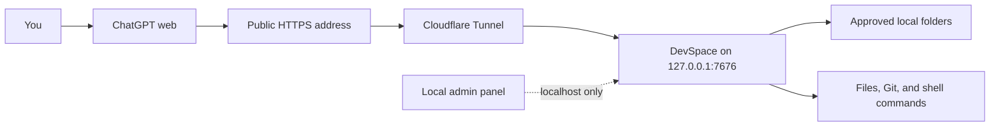

<p align="center">
  <a href="./README.md">简体中文</a> · <strong>English</strong>
</p>

<p align="center">
  
</p>

<h1 align="center">DevSpace</h1>

<p align="center">
  <strong>Let ChatGPT read, edit, and test projects on your computer.</strong>
</p>

<p align="center">
  DevSpace turns approved local folders into secure MCP tools.<br>
  ChatGPT works on the real files; your whole repository is not uploaded to a hosted sandbox.
</p>

<p align="center">
  <a href="https://github.com/keepkeen/devspace/blob/main/LICENSE"></a>
  
  
  
</p>

<p align="center">
  <a href="#quick-start">Quick start</a> ·
  <a href="#connect-chatgpt">Connect ChatGPT</a> ·
  <a href="#how-to-use-it">How to use it</a> ·
  <a href="#why-this-fork">Fork highlights</a> ·
  <a href="#security">Security</a>
</p>

<p align="center">
  <a href="./docs/assets/devspace-screenshot.png">
    
  </a>
</p>

> [!IMPORTANT]
> This is a community fork of
> [Waishnav/devspace](https://github.com/Waishnav/devspace), based on upstream
> commit [`80423b5`](https://github.com/Waishnav/devspace/commit/80423b5).
> It is not an official upstream release.

## What is DevSpace?

ChatGPT runs in the cloud. It cannot normally open a path such as
`/Users/alice/code/my-app` on your computer. Code Interpreter and hosted Python
also run on a different machine, so giving them a local path does not help.

DevSpace solves this by running a small MCP server on your computer. After you
approve a folder, ChatGPT can call tools to:

- read files and search the project;
- edit files and apply patches;
- run tests, linters, builds, and other shell commands;
- inspect Git changes;
- follow `AGENTS.md`, `CLAUDE.md`, and local Skills;
- continue using the same workspace after a conversation or network session ends.

In the normal workflow, DevSpace is a tool server rather than another coding
agent. ChatGPT decides which DevSpace tools to call, and each call is visible in
the conversation. Optional local subagents exist for advanced use, but they are
disabled by default.

Only folders in your allowlist can be opened by the dedicated file tools. Only
content returned by a tool call is sent to the connected MCP client; DevSpace
does not upload the entire repository in advance.

## How it works



The public address carries MCP and OAuth traffic. The management panel listens
only on localhost and is not exposed through the tunnel.

## Quick start

### Requirements

- Node.js `>=22.19 <27`
- npm and Git
- Bash on macOS/Linux, or Git Bash/WSL on Windows
- a public HTTPS tunnel such as
  [Cloudflare Tunnel](https://developers.cloudflare.com/cloudflare-one/connections/connect-networks/)
- a ChatGPT account or workspace that allows developer mode

Use the same Node.js installation for `npm ci`, `npm run build`, and the running
service. DevSpace uses `better-sqlite3`, which is compiled for a specific Node
ABI.

### 1. Install this fork

```bash
git clone https://github.com/keepkeen/devspace.git
cd devspace
npm ci
npm run build
```

The examples below run the CLI from the cloned repository:

```bash
node dist/cli.js --help
```

If you prefer the shorter `devspace` command:

```bash
npm link
devspace --help
```

### 2. Configure DevSpace

```bash
node dist/cli.js init
```

The setup wizard asks for three things:

1. **Allowed roots** — folders ChatGPT may open, such as
   `/Users/alice/code`.
2. **Local port** — normally `7676`.
3. **Public base URL** — your HTTPS tunnel address, without `/mcp`.

DevSpace stores normal settings and the Owner password separately:

```text
~/.devspace/config.json
~/.devspace/auth.json
```

Keep `auth.json` private. Anyone with its Owner password can approve a new MCP
client.

### 3. Start DevSpace

```bash
node dist/cli.js serve
```

Leave the process running and verify it from another terminal:

```bash
curl http://127.0.0.1:7676/readyz
```

A healthy server returns HTTP `200` and JSON containing:

```json
{"ok":true,"name":"devspace","status":"ready"}
```

You can also run a local installation check:

```bash
node dist/cli.js doctor
```

### 4. Start an HTTPS tunnel

For a quick test:

```bash
cloudflared tunnel --url http://127.0.0.1:7676
```

Cloudflare prints a temporary URL such as:

```text
https://random-name.trycloudflare.com
```

Save it in DevSpace and restart the DevSpace process:

```bash
node dist/cli.js config set publicBaseUrl https://random-name.trycloudflare.com
node dist/cli.js serve
```

Then verify the complete public route:

```bash
curl https://random-name.trycloudflare.com/readyz
```

Quick Tunnel addresses change when the tunnel restarts. For regular use, create
a named Cloudflare Tunnel with a stable hostname:

```bash
cloudflared tunnel login
cloudflared tunnel create devspace
cloudflared tunnel route dns devspace devspace.example.com
```

Example `~/.cloudflared/config.yml`:

```yaml
tunnel: YOUR_TUNNEL_UUID
credentials-file: /Users/you/.cloudflared/YOUR_TUNNEL_UUID.json

ingress:
  - hostname: devspace.example.com
    service: http://127.0.0.1:7676
  - service: http_status:404
```

Start the named tunnel:

```bash
cloudflared tunnel --config ~/.cloudflared/config.yml run devspace
```

Finally, save its public address:

```bash
node dist/cli.js config set publicBaseUrl https://devspace.example.com
```

## Connect ChatGPT

OpenAI currently calls custom MCP integrations **developer-mode apps**. The UI
can change, so the current official guide is
[Connect from ChatGPT](https://developers.openai.com/apps-sdk/deploy/connect-chatgpt).

1. In ChatGPT, open **Settings → Security and login** and enable
   **Developer mode**. Your workspace administrator may need to allow it.
2. Open **Settings → Plugins**, or visit
   [chatgpt.com/plugins](https://chatgpt.com/plugins).
3. Create a new developer-mode app.
4. Give it a clear name and description, for example `Local DevSpace`.
5. Enter the full MCP endpoint:

   ```text
   https://devspace.example.com/mcp
   ```

6. Create the app and review the tools ChatGPT discovers.
7. Complete the DevSpace OAuth page with the Owner password from
   `~/.devspace/auth.json`.
8. Start a new chat, click the **+** button near the composer, choose
   **More**, and add the DevSpace app to the conversation.

When DevSpace adds or changes tools, open the app in **Settings → Plugins** and
choose **Refresh**. Restarting only the local server does not automatically
refresh ChatGPT's cached tool definitions.

## How to use it

For the first connection to a project, provide its exact path and a memorable alias:

```text
Use DevSpace to open /Users/alice/code/my-app as alias my-app.
Read the project instructions, find the failing tests, fix the problem,
run the smallest relevant verification, and summarize the changed files.
```

The expected workflow is:

1. ChatGPT calls `open_workspace` with the path and alias. The default response
   is metadata-only, so instructions and Skills are not injected yet.
2. It calls `get_workspace_context(alias, full)` for the `workspaceId`, project
   instructions, and Skill catalog. Only explicit `contextMode: "retained"`
   permits revision-based body suppression.
3. ChatGPT reuses that `workspaceId` for reads, searches, edits, and commands.
4. Each ChatGPT tool call may use a fresh stateless HTTP transport. Continuity
   comes from `workspaceId`, so reconnects and stale MCP session headers do not
   interrupt the workspace. The same authorized client can reopen and reuse the
   same workspace in later conversations. A new conversation calls
   `list_workspaces`, then `resume_workspace(alias, full)`, without resending an
   absolute host path.
   If the ChatGPT app is deleted, refreshed, or re-authorized as a new OAuth
   client, discard any rejected old `workspaceId` and call `open_workspace`
   again immediately.
5. `close_workspace` is used only when you explicitly ask to release it.
   Unused workspaces may also expire after the configured idle period.

New checkout workspaces default to read-only. Use explicit
`writeAccess: "read_write"` when the current checkout must be modified, or
prefer `mode: "worktree"` for an isolated writable workspace. Existing
persisted checkouts retain write access across the upgrade.

Do not tell ChatGPT to use hosted Python or Code Interpreter to inspect a local
path. Those tools are still fine for unrelated calculations or generated data;
local project work should go through DevSpace.

### Two ChatGPT accounts

Different OAuth clients receive different workspace IDs and process sessions.
If both accounts open the same approved checkout, they still edit the same files
on disk. This fork isolates identities and resources, but it does not merge or
lock concurrent edits to the same file. Avoid simultaneous writes unless you
use separate Git worktrees.

### `AGENTS.md` and Skills

The initial `open_workspace` call returns metadata by default. After
`get_workspace_context(alias, full)`, DevSpace returns structured
`workspaceInstructions[]` records with source, scope, relative path, revision,
trust, and content. One user-level file may be explicitly
selected in the Admin panel or with `DEVSPACE_USER_INSTRUCTIONS_PATH`. DevSpace does not
implicitly read `~/.codex/AGENTS.md`; `DEVSPACE_AGENT_DIR` is only a Skill
compatibility root. Reads only advertise `scopedInstructionsAvailable=true`.
Before a mutation or command, ChatGPT calls `load_workspace_instructions` for
the intended paths and receives structured instructions plus a one-time token.
Whitespace-only files are skipped, the combined user/root/nested
instruction chain is limited to 32 KiB, and interactive `write_stdin` input is
gated when a running process may enter a newly instructed directory. Each
full-context result includes a `sha256-v1:` `instructionRevision` over the
ordered initial path/content pairs so clients can recognize an unchanged chain.
The Skill catalog has an independent `skillRevision`; pass
`knownSkillRevision` only with explicit `contextMode: "retained"` while the
prior catalog is still retained. Use `full` after a new conversation or context
compaction.

DevSpace also advertises matching local Skills; `list_skills` adds bounded
search and pagination. ChatGPT web has no Codex
`$skill` or `/skills` picker, so the model calls `load_skill` to load one
complete `SKILL.md`. Supporting files remain unavailable until that succeeds.
It can then read references, scripts, and other support files through paths
such as `skill://<skillId>/references/example.md` without receiving the host's
absolute Skill path. Duplicate names are preserved and distinguished by
`skillId`, a privacy-safe logical path, and scope.
See the detailed
[ChatGPT coding workflow](./docs/chatgpt-coding-workflow.md).

### Fixed tool contract

DevSpace exposes one stable Codex-style surface: `read`, `batch_read`,
`batch_inspect`, `apply_patch`, `exec_command`, `write_stdin`, and
`read_process_output`, plus `list_workspaces`, `resume_workspace`,
`get_workspace_context`, `load_workspace_instructions`, `get_operation_status`,
`revoke_workspace`, and optional Skill tools. It no longer
switches between `bash`, `exec_command`, or dedicated file-tool names, avoiding
stale ChatGPT tool-schema confusion.

`exec_command` prefers direct `program` plus `args`, preserving argument
boundaries without shell parsing. Use `shell: true` plus `command` only for
shell syntax; legacy `cmd` remains compatible. For multiline Python, SQL, or SSH scripts, the model can use the structured
`stdin` field on `exec_command` instead of fragile nested quoting. Stdin
closes by default after an initial payload; set `closeStdin: false` to continue
through `write_stdin`, which can append data or close the stream. PTY sessions
do not emulate EOF with Ctrl-D.

`apply_patch`, `exec_command`, and mutating `write_stdin` calls accept an
optional `operationId`. Use a fresh ID for a new operation and reuse it only
after a lost network response; DevSpace replays the stored result instead of
executing twice. Failures expose structured `error.code`, `retryable`,
`safeToRetry`, and `recovery`. A non-zero command exit returns `ok: false`,
`status: "exited"`, `commandExecuted: true`, and `exitCode`; it is distinct
from a command that never started.
`get_operation_status(operationId)` checks retained state without executing or
repeating the stored result body.

Every Workspace-scoped tool requires both `workspaceId` and
`workspaceGeneration`. Restarts, OAuth reauthorization, allowed-root changes, and close/reopen cycles
stale old handles. `read` returns `contentHash` and exact string `mtimeNs`;
`apply_patch.ifMatch` checks one or more paths before the first write.

Equivalent managed-worktree opens reuse the same active worktree for one OAuth
connection and base commit; set `forceNew: true` only for an explicitly separate
isolation. `list_workspaces` returns persisted `dirtySource`, while compact
`project` context reports an empty project, bounded top-level names, and
best-effort Git branch/dirty state. Expiry removes only clean worktrees and
never automatically deletes a dirty one.

When several independent files or searches are already known, `batch_read` and
`batch_inspect` reduce MCP round trips. Optional short input refs are echoed,
and results explicitly report `completed`, `partial`, or `failed` with counts.
DevSpace does not force batching when
the next file depends on the result of the previous search.

DevSpace keeps each large model-visible payload in one place so the same file
or command output does not consume context in both `content` and
`structuredContent`. Reads and Skill loads put body text only in `content`;
process structures emit only actionable handles or exceptional state. Batch
tools keep `ref/ok/result` entries in `structuredContent.items[]` without
echoing host paths, and there is no aggregate `result`. `_meta` is
optional ChatGPT component data and can be
ignored by ordinary MCP clients. Clients that consumed the old duplicate
fields must follow these result locations; see the
[ChatGPT coding workflow](./docs/chatgpt-coding-workflow.md) for the full contract.
Each loaded `SKILL.md` is capped at 64 KiB.

## Keep it running

For an always-available ChatGPT connection, both processes must stay alive:

```text
DevSpace server  +  HTTPS tunnel
```

Run both with an OS service manager such as `launchd` or `systemd`, enable
automatic restart, and use a stable tunnel hostname. A ChatGPT conversation may
end without closing the local workspace; DevSpace's workspace state is stored
in SQLite and is not tied to one HTTP connection.

If the server restarts, ChatGPT may open a fresh MCP transport. Existing
checkout workspaces remain available, but an old ID requires hydration before
direct use: call `list_workspaces`, then `resume_workspace(alias, full)`.

<details>
<summary><strong>Shadowrocket or another TUN proxy</strong></summary>

Put direct Cloudflare Tunnel rules before your generic proxy and final rules:

```text
DOMAIN,region1.v2.argotunnel.com,DIRECT
DOMAIN,region2.v2.argotunnel.com,DIRECT
DOMAIN-SUFFIX,argotunnel.com,DIRECT
IP-CIDR,198.41.192.0/24,DIRECT,no-resolve
IP-CIDR,198.41.200.0/24,DIRECT,no-resolve
IP-CIDR6,2606:4700:a0::/48,DIRECT,no-resolve
IP-CIDR6,2606:4700:a8::/48,DIRECT,no-resolve
```

Do not route the whole `198.18.0.0/15` Fake-IP range directly.

</details>

## Local management panel

```bash
node dist/cli.js admin
```

DevSpace opens a one-time URL on localhost. The panel can:

- add and remove allowed folders, applied live without a restart;
- choose the widget mode and user-level instruction file;
- set MCP, process, workspace, command, and worktree limits;
- show backend, tunnel, quota, and recent failure status;
- download a redacted diagnostic report;
- revoke all OAuth clients and tokens;
- restart an explicitly enrolled macOS `launchd` backend and verify the new PID
  and readiness generation.

Saving settings does not silently restart the backend. Allowed-root changes are
hot-reloaded: additions are available immediately, while removals invalidate
affected workspaces and terminate their running commands. Other runtime changes
take effect after a verified restart. On macOS, backend control
must be explicitly enabled for the admin process, for example:

```bash
DEVSPACE_LAUNCHD_SERVICE_LABEL=com.waishnav.devspace node dist/cli.js admin
```

The panel never starts, adopts, or kills an arbitrary `cloudflared` process.
Tunnel control is intentionally status-only.

## Why this fork?

The upstream project proved that a local workspace could be exposed through
MCP. This fork focuses on making that workflow dependable for daily ChatGPT web
use.

The comparison is against upstream commit
[`80423b5`](https://github.com/Waishnav/devspace/commit/80423b5).

| Area | What this fork adds |
| --- | --- |
| Long-lived workspaces | Workspace state is independent of short-lived ChatGPT MCP connections and survives server restarts. Reopening the same checkout reuses the workspace instead of creating endless duplicates. |
| Clear GPT instructions | Tool descriptions explain that local paths belong to DevSpace, when to reuse a workspace, when not to close it, and when batch tools help. |
| Faster inspection | `batch_read`, `batch_inspect`, lazy instruction discovery, and caches remove many avoidable MCP round trips and large-directory scans. |
| Safer lifecycle | Workspace operation leases, exclusive close, request draining, process termination, and cleanup rules prevent resources from being closed while still in use. |
| Real resource limits | Global and per-client limits cover MCP sessions, workspaces, processes, worktrees, output, and command runtime. Hung commands receive `SIGTERM` and then `SIGKILL` after a grace period. |
| Client isolation | OAuth ownership is enforced for MCP sessions, workspaces, processes, and stored state. One client cannot reuse another client's IDs. |
| Project instructions | Instructions are structured with source, scope, and revision; reads advertise availability only, mutations explicitly load and acknowledge them, empty files are skipped, and the chain is capped at 32 KiB. |
| Local Skills | Skills come from repository ancestors within an approved root plus user, Admin, and DevSpace bundled scopes; duplicate names remain visible, the catalog is capped at 8,000 UTF-8 bytes, and ChatGPT web loads a selected Skill through `load_skill`. |
| Safer shell workflow | High-risk command patterns are blocked and inline output stays bounded; background/PTY sessions can be polled or interrupted, while available durable output is replayable by opaque `outputId` through `read_process_output`. |
| Admin panel | A localhost-only React panel manages roots and limits, detects concurrent config edits with revision/ETag checks, verifies restarts, and exposes sanitized diagnostics. |
| OAuth hardening | Approval pages cannot be framed, expired records are cleaned up, the owner can revoke every client and token in one action, and tokens are stored as hashes. |
| Observable behavior | Structured request/tool logs use `connectionRef` for OAuth registrations and `workspaceActivityRef` for different project activities under one connection, alongside readiness generations, resource usage, sanitized failures, and downloadable diagnostics. |
| Tested distribution | Node 24/26 CI, macOS/Linux/Windows process tests, real browser tests, `npm pack`, installed-package CLI startup, and SQLite native-module checks. |

## Security

DevSpace gives a remote model controlled access to your computer. Treat an
authorized ChatGPT app like a coding collaborator with the permissions of the
OS user running DevSpace.

DevSpace enforces:

- a narrow allowlist for dedicated file tools;
- canonical-path and symlink checks;
- OAuth approval and per-client ownership;
- Host and redirect allowlists;
- bounded sessions, processes, output, and command runtime;
- a localhost-only admin panel;
- explicit write annotations and ChatGPT confirmations.

> [!WARNING]
> `exec_command` runs with the permissions of the DevSpace OS user.
> The file-tool allowlist is not an operating-system sandbox for arbitrary shell
> commands. For hard isolation, run DevSpace under a dedicated OS account or in
> a container/VM with only approved folders mounted.

Recommended setup:

1. Approve the narrowest possible folders.
2. Keep `~/.devspace/auth.json` and tunnel credentials private.
3. Never expose the admin panel to the public tunnel.
4. Use TLS and a stable hostname.
5. Review write confirmations and Git diffs.
6. Use a dedicated OS account for higher-risk or multi-user environments.

Read the full [security model](./docs/security.md).

## Configuration

Common commands:

```bash
node dist/cli.js init
node dist/cli.js doctor
node dist/cli.js config get
node dist/cli.js config set publicBaseUrl https://devspace.example.com
node dist/cli.js admin
```

Common environment variables:

| Variable | Default | Purpose |
| --- | --- | --- |
| `HOST` | `127.0.0.1` | Local bind address. |
| `PORT` | `7676` | Local MCP server port. |
| `DEVSPACE_ALLOWED_ROOTS` | — | Comma-separated approved folders. |
| `DEVSPACE_PUBLIC_BASE_URL` | — | Public HTTPS origin without `/mcp`. |
| `DEVSPACE_WIDGETS` | `full` | `full`, `changes`, or `off`. |
| `DEVSPACE_MAX_MCP_SESSIONS` | `64` | Global live MCP session limit. |
| `DEVSPACE_MAX_PROCESS_SESSIONS` | `32` | Global retained process limit. |
| `DEVSPACE_MAX_PROCESS_OUTPUT_FILE_BYTES` | `67108864` | Durable complete-output limit per process (64 MiB). |
| `DEVSPACE_MAX_PROCESS_OUTPUT_STORAGE_BYTES` | `1073741824` | Total durable process-output storage limit (1 GiB). |
| `DEVSPACE_COMPLETED_PROCESS_OUTPUT_TTL_SECONDS` | `86400` | Retention for completed process output (24 hours). |
| `DEVSPACE_MAX_COMMAND_RUNTIME_SECONDS` | `3600` | Hard command runtime limit. |

See the full [configuration reference](./docs/configuration.md).

## Troubleshooting

<details>
<summary><strong>ChatGPT says the local tool is disabled</strong></summary>

- Make sure the DevSpace app is added to the current conversation.
- Check that the configured URL ends in `/mcp`.
- Run `curl https://your-host/readyz`.
- Refresh the app from ChatGPT's plugin settings after tool changes.
- Reauthorize OAuth if the client or token was revoked.

</details>

<details>
<summary><strong>The public URL returns 502</strong></summary>

Check the local server first:

```bash
curl http://127.0.0.1:7676/readyz
```

If local readiness works, inspect `cloudflared` and confirm its ingress target
is `http://127.0.0.1:7676`.

</details>

<details>
<summary><strong><code>better-sqlite3</code> cannot load</strong></summary>

The install and the service probably use different Node.js ABIs:

```bash
npm rebuild better-sqlite3
node dist/cli.js doctor
```

</details>

<details>
<summary><strong>Tool calls are slow</strong></summary>

- Use `batch_read` or `batch_inspect` after several independent targets are known.
- Compare local and public `/readyz` latency.
- Route Cloudflare Tunnel endpoints outside VPN/TUN proxies when appropriate.
- Remember that a long test or build is command time, not MCP transport time.

</details>

More cases are documented in [Troubleshooting Gotchas](./docs/gotchas.md).

## Development

```bash
npm ci
npm run dev
npm run typecheck
npm test
npm run test:browser
npm run build
```

## Documentation

- [Setup guide](./docs/setup.md)
- [ChatGPT coding workflow](./docs/chatgpt-coding-workflow.md)
- [Configuration reference](./docs/configuration.md)
- [Security model](./docs/security.md)
- [Troubleshooting](./docs/gotchas.md)

## Upstream and attribution

DevSpace was created by [Waishnav](https://github.com/Waishnav). This fork keeps
the original history, assets, and MIT license while maintaining a separate set
of changes for persistent ChatGPT workflows, security, latency, and local
administration.

- Upstream: [Waishnav/devspace](https://github.com/Waishnav/devspace)
- This fork: [keepkeen/devspace](https://github.com/keepkeen/devspace)
- Baseline: [`80423b5`](https://github.com/Waishnav/devspace/commit/80423b5)

## License

[MIT](./LICENSE) © Waishnav and contributors. Fork changes use the same license.
